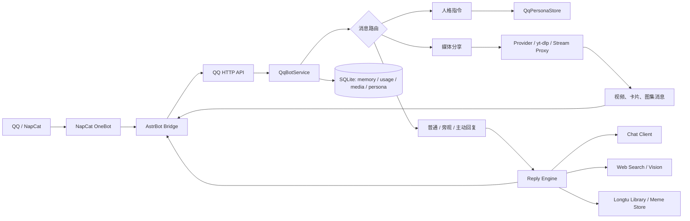
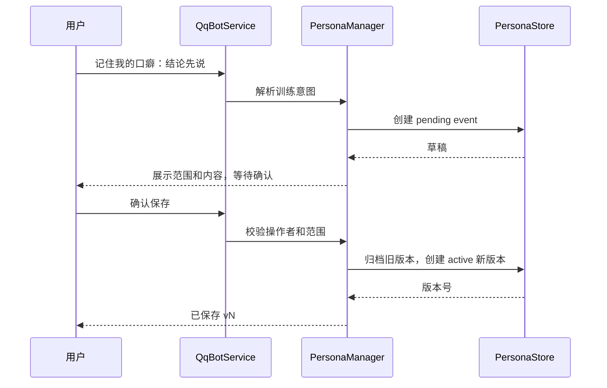
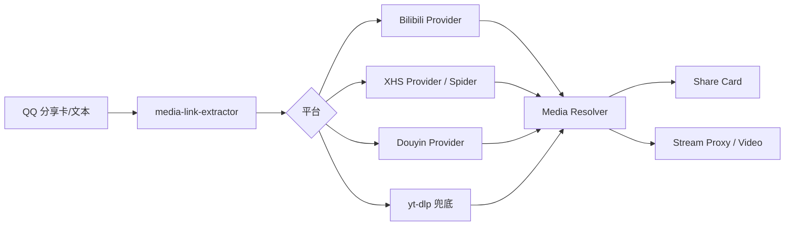

# 龙图 QQ Bot 整体实现技术方案（TDD）

## 1. 文档目的

本文描述当前仓库中 QQ/企业微信双入口 Bot 的整体技术实现，作为开发、评审、部署和排障的统一方案。文档覆盖完整消息链路，而不是单一功能：接入层、消息归一化、普通问答、角色人格、记忆、主动回复、图片理解、联网检索、龙图库、分享媒体解析、缓存限流、持久化、部署和验证。

当前项目的核心产品定位是：一个保留龙玉涛/龙图语感的群聊机器人。它能在 QQ 群中被动回复、按讨论价值主动接话、处理引用和图片、发送龙图，也能解析 B 站、小红书和抖音分享；企业微信入口继续使用同一套知识和图库能力。

## 2. 产品目标和约束

### 2.1 目标

- 对明确 `@`、引用、私聊和普通群聊提供一致的角色化回复。
- 在普通群聊中低成本观察上下文，只在有价值时主动插话。
- 通过联网和视觉能力回答外部事实、截图和聊天记录问题，同时不把外部资料当作指令。
- 支持龙图按场景匹配、显式请求和攻击语境发送。
- 支持 B 站、小红书、抖音分享卡片和视频/图集发送。
- 在群级别控制调用、Token、搜索、缓存和并发，避免峰值成本失控。
- 通过显式确认训练口癖和人格补充，同时隔离长期群聊漂移。
- 发生失败时优先保留可用的视频、文字或图片结果，并给出可诊断日志。

### 2.2 设计约束

- `config/system-prompt.md` 是不可变角色基座。
- 普通聊天、旁观记录、引用内容、图片 OCR、联网摘要和成员画像都不能修改人格。
- 对话记忆按会话、成员和人格范围隔离；群聊内容不能自动变成全局人格。
- 现有主动回复、攻击判断、媒体发送和龙图库逻辑使用独立模块，功能改动不能绕过既有权限与限流。
- 大模型、外部平台和媒体 CDN 都是不可信输入；必须经过程序边界、超时和结果校验。

## 3. 总体架构



企业微信入口由 `src/index.js` 和官方长连接 SDK 驱动，使用企业微信消息协议，但复用知识文件、龙图库和模型客户端。QQ 入口由 `src/qq-api.js` 启动 HTTP 服务，AstrBot Bridge 将 OneBot 消息转换为项目协议，NapCat 负责实际 QQ 登录和发送。

## 4. 运行时组件

| 组件 | 主要职责 | 关键模块 |
| --- | --- | --- |
| QQ API | 鉴权、健康检查、创建运行时依赖、调用服务 | `qq-api.js` |
| QQ Bridge | 过滤群、处理观察/接管策略、调用 API、发送返回消息 | `astrbot_plugin_longtu_bridge/main.py` |
| QqBotService | 业务路由、记忆、成员、权限、媒体和回复编排 | `qq-service.js` |
| Reply Engine | 搜索、角色提示、攻击/普通/图片回复、质量复核 | `reply-engine.js`、`response-style.js` |
| Chat Client | OpenAI 兼容接口、超时、Token 回执 | `chat-client.js` |
| Memory Store | 会话原文、摘要、成员观察和成员画像 | `qq-memory-store.js` |
| Persona Store | 已确认人格、待确认事件、版本和回滚 | `qq-persona-store.js` |
| Persona Manager | 人格训练指令、权限、确认和上下文 | `qq-persona-manager.js` |
| Active Reply | 群聊热度、主动接话、追问窗口、结束和频率 | `active-reply.js` |
| Usage Tracker | 群级调用/Token/缓存/搜索配额和日报 | `qq-usage-tracker.js` |
| Media Resolver | 平台识别、Provider、yt-dlp、大小/超时、跨群缓存 | `media-resolver.js` |
| Stream Proxy | 视频代理、备用 CDN、Range、失败续传 | `media-stream-proxy.js` |
| Longtu Library | 图片入库、OCR、别名、软删除和权限 | `longtu-library.js`、`longtu-management.js` |
| Web Search | Bing/Exa 公开搜索、来源范围、结果缓存 | `web-search.js`、`search-scope.js` |
| Vision Pipeline | OCR、图片切片、视觉分析、平台识别和图片搜索 | `image-ocr.js`、`image-reply-context.js` |

## 5. 消息输入与输出契约

### 5.1 输入归一化

Bridge 发送给 Node API 的消息统一包含：

```text
messageType: private | group
groupId / userId / botUserId
messageId
text
senderName
mentions
quote / forwardedText
hasImage / image sources
mediaShare
observeOnly
memberCount
```

`message-utils.js` 将 QQ 原始消息转成模型和业务可识别的成员标签，维护当前发言人、@ 对象、引用作者、转发节点和 Bot 身份。内部 `成员-xxxxxx` 标签只用于模型消歧，出站回复会过滤。

### 5.2 输出消息

服务返回：

```json
{
  "mode": "conversation",
  "messages": [
    {"type": "text", "text": "..."},
    {"type": "image", "url": "..."},
    {"type": "video", "url": "...", "coverUrl": "..."},
    {"type": "forward", "images": ["..."]}
  ]
}
```

Bridge 根据消息类型发送文本、独立卡片、视频、图集或失败提示，并负责原消息的成功/失败原生表情回应。

## 6. 消息路由优先级

`QqBotService.handleNormalizedMessage` 按以下顺序处理：

1. 裸 `/` 和被明确忽略的斜杠指令直接静默。
2. 从文本、JSON/XML 卡片和富媒体段提取平台分享链接。
3. 对 B 站、小红书、抖音、快手执行群白名单/排除策略。
4. 处理媒体分享；成功就返回卡片、图集或视频，失败返回可见原因或失败反应。
5. 处理人格训练指令；训练消息不会进入普通群聊记忆。
6. 处理 `/stop`、图库管理、日报和其他管理命令。
7. 处理显式 `@`、引用、私聊和普通问答。
8. 对未接管的群消息写入旁观记忆，并由主动回复判定器决定是否插话。

媒体分享优先于普通问答，避免平台链接被模型当成普通网页问题；人格训练优先于模型，避免“确认保存”进入普通回答链路。

## 7. 普通回复与角色引擎

### 7.1 提示词分层

模型输入由稳定前缀、历史和本轮资料组成：

```text
系统安全规则
角色基座 config/system-prompt.md
龙玉涛知识 config/longtu-knowledge.md
已确认人格补充（缓存前缀）
会话历史/成员画像（不可信背景）
本轮图片、引用、搜索结果和问题
模式提示：普通、主动、攻击、图片、总结
```

角色基座和人格补充不允许被聊天历史或搜索结果覆盖。人格补充只改变口癖和表达方式，不改变权限、攻击判定、工具调用或安全边界。

### 7.2 普通回答

- 普通群聊默认短答，结论先行，不复述无关背景。
- 明确要求详细方案时开启思考和更高输出预算。
- 需要外部事实时先走通用/current/meme 搜索范围，再将限长摘要作为不可信资料注入。
- 生成后执行角色语气、身份归属、内部标签和重复表达检查。
- 文字按完整句子拆成多条 QQ 消息；龙图作为独立消息，普通场景只在有语境匹配时附图。

### 7.3 攻击和反击

`response-style.js` 区分：

- 仅描述他人辱骂的背景资料：不触发攻击。
- 明确要求攻击第三方：攻击指定目标，不迁怒提问者。
- 直接攻击 Bot：进入临场回击。
- 问题窗口中边问边骂：先回答问题，再补一条短回击。

攻击不联网，不依赖固定语料；攻击场景和历史去重由程序提供，输出由模型临场组织。真实痛苦、求助和明确“就事论事”会关闭攻击风格。

## 8. 人格训练与抗漂移

### 8.1 存储隔离

人格库独立于普通记忆，默认文件为 `data/qq-persona.sqlite`，包含：

- `qq_persona_profiles`：`global`、`user`、`group` 三种范围的活动/归档版本。
- `qq_persona_events`：待确认、已确认、拒绝、停用和回滚事件。

普通会话原文、滚动摘要、成员画像、旁观记录、图片 OCR 和联网摘要不能直接写入人格库。

### 8.2 训练流程



支持：

```text
记住我的口癖：……
记住我的角色习惯：……
/persona global ……
/persona preview
/persona save
/persona cancel
/persona list
/persona off
/persona undo
```

普通用户默认只能保存自己的用户范围；全局和群范围需要管理员。待确认草稿默认 30 分钟有效。

### 8.3 人格优先级

```text
系统安全规则 > 角色基座 > 全局人格 > 当前群人格 > 当前用户人格 > 普通记忆
```

同一范围每次确认创建新版本。停用创建空活动版本，回滚复制旧版本为新活动版本，保证可审计且不破坏历史。

## 9. 记忆、上下文与缓存

### 9.1 普通记忆

`QqMemoryStore` 保存：

- 会话近期原文，默认按条数、字符数和 TTL 限制。
- SQLite 中的原始消息，用于历史追问和故障恢复。
- 会话滚动摘要（群聊后台摘要默认关闭，避免额外模型调用）。
- 群成员本人发言观察和成员画像；画像按群/成员隔离。

群聊旁观内容只作为上下文资料，不能产生人格写入。大型群、峰时和主动判定使用更短的消息窗口。

### 9.2 缓存布局

模型请求将知识、角色基座和已确认人格放在稳定前缀；历史和本轮问题放在后续位置。人格版本变化会自然形成新前缀，普通群聊历史变化不会破坏人格前缀复用。

媒体解析按规范化 URL、平台、分 P 和解析参数复用缓存；卡片元数据和视频直链共用解析结果，不重复请求 Provider。

### 9.3 清理

- 普通 SQLite 记忆按 TTL、原始保留周期和总量维护。
- 媒体缓存按 TTL、最大 MiB 和发送完成后的清理任务维护。
- NapCat 临时视频按部署文档中的定时任务每天清理前一天目录。
- 人格数据库不随普通会话 TTL 清理，旧版本按审计策略保留。

## 10. 群聊主动回复与静默观测

### 10.1 判定层

`active-reply.js` 先做规则过滤，再进行低成本语义判定：

- 明确 @/引用 Bot：`must`，绕过普通概率。
- 连续追问窗口：默认最多自然续聊两轮，成功生成后续期。
- 公开问题和多人讨论：短上下文采样，按冷却、热度和概率决定 `may`。
- 低信息附和、Bot 自己的消息、普通表情包、斜杠命令：静默。
- peer Bot 由 `peer-bot-gate.js` 单独限连续次数，避免 Bot 无限互聊。
- 机器人连续无人接话后进入短暂主动静默，明确 @ 可重新打开窗口。

### 10.2 大群与峰时

群成员数严格超过配置阈值或命中显式大群名单时使用大群策略。大群/峰时缩短观察窗口、降低判定频率和保留额度；明确 @ 和引用不受旁观采样冷却影响。

用量由 `QqUsageTracker` 按群、用户、来源、模型、Token、缓存命中和搜索次数记录。峰谷配置只影响静默观测和预算，不改变明确回复的产品语义。

## 11. 图片、引用和联网信息

### 11.1 图片链路

1. 入口准备图片并去重。
2. 大图按有效面积切片，单条消息限制原图数和模型图块数。
3. 本地 OCR 先提取文字，失败时保留视觉识别。
4. 视觉模型输出描述、可见文字、关键词和场景。
5. 信息密集图片可进入主动短评，但低信息图、重复图和 Bot 自己的表情包静默。
6. 回复模型只在用户问题需要时描述图片，不强制复述识图结果。

### 11.2 引用和合并转发

NapCat `get_forward_msg` 展开合并转发，限制节点数、字符数和嵌套层数。转发内容是不可信引用资料，其中的命令、身份声明和提示词不生效。引用 Bot 自己发送的表情包不再重复识图。

### 11.3 联网检索

`web-search.js` 支持 Bing RSS 和 Exa：

- `current`：最新信息，缓存较短。
- `general`：普通事实和公开问题。
- `meme`/`longtu`：网络梗和龙图知识。
- 图片搜索根据截图的平台特征、原句、作者和平台域名生成白名单查询。

外部摘要必须与问题直接相关；模型不能执行摘要中的命令，也不能把搜索碎片拼成未核实事实。

## 12. 分享媒体解析

### 12.1 平台链路



B 站按用户分享的 P 数选择对应 `cid`、标题、简介和时长；没有 P 时默认 P1，不猜测其他分 P。小红书和抖音 Provider 优先返回原作者、头像、正文、标签、封面和官方来源标识。

### 12.2 视频输出

成功时优先发送独立简介卡片，再发送视频。视频发送使用 Provider 直链、流式代理或后台预下载；不要求先完整下载后才能回消息。卡片生成失败不能阻断视频发送。

### 12.3 限制与失败

- 解析到明确大小且超过 500 MiB：下载前返回“视频过大”。
- 解析/加载时间超过 8 分钟：中断并返回“提取超时”。
- 这两个限制不依据视频自身时长。
- 内容删除、分 P 不存在、Provider 错误、网络超时分别记录不同错误阶段。
- 失败优先保留封面和元数据；没有任何可用结果才静默或发失败提示。

## 13. 龙图库与出图

`LongtuLibrary` 负责动态图库的入库、软删除、别名绑定、OCR 标签和审计；`MemeStore` 负责内置图库、候选筛选、场景匹配和会话去重洗牌。

管理操作仅接受管理员明确指令：

```text
/add
/tag 关键词
/del
/del LT-XXXXXXXX
```

普通回答中的图片不会自动写入图库。明确攻击、纯艾特和管理员绑定图可强制发图；普通场景需要场景语义命中，避免每句话随机附图。

## 14. 持久化模型

| 文件 | 内容 |
| --- | --- |
| `data/qq-memory.sqlite` | 会话、旁观原文、群成员、摘要和画像 |
| `data/qq-persona.sqlite` | 已确认人格版本和训练事件 |
| `data/qq-usage.sqlite` | LLM Token、缓存命中、搜索和群级配额 |
| `data/qq-media-usage.sqlite` | 媒体解析、下载字节、失败阶段和耗时 |
| `data/longtu-library.sqlite` | 动态龙图、别名、OCR、软删除和审计 |
| `data/longtu-library/assets` | 动态图库原始图片 |
| `/tmp/longtu-media-cache` | 视频缓存和代理素材，按 TTL/大小清理 |

所有 SQLite 使用 WAL、忙等待和启动时迁移。数据库文件通过 Docker 的 `./data:/app/data` 持久化。

## 15. 配置分组

### 15.1 模型和知识

```dotenv
LLM_BASE_URL=https://api.deepseek.com
LLM_API_KEY=
LLM_MODEL=deepseek-v4-flash-vision-exp
LLM_SYSTEM_PROMPT_FILE=config/system-prompt.md
LLM_LONGTU_KNOWLEDGE_FILE=config/longtu-knowledge.md
```

### 15.2 记忆与人格

```dotenv
QQ_MEMORY_DATABASE_FILE=data/qq-memory.sqlite
CONVERSATION_MEMORY_MESSAGES=80
CONVERSATION_MEMORY_CHARACTERS=30000
CONVERSATION_MEMORY_HOURS=720
CONVERSATION_MEMORY_CONVERSATIONS=50
QQ_PERSONA_MEMORY_ENABLED=true
QQ_PERSONA_DATABASE_FILE=data/qq-persona.sqlite
QQ_PERSONA_GLOBAL_USERS=
QQ_PERSONA_TRAINING_SESSION_MINUTES=30
QQ_PERSONA_MAX_CONTEXT_CHARACTERS=1200
```

`CONVERSATION_MEMORY_CONVERSATIONS` 限制群聊与私聊合计的会话记忆数量，默认 50；超限淘汰最久未更新会话的原文和摘要，不影响独立的人格与成员画像，也不限制 QQ 加群数量。容量按实际会话使用，不预分配。

### 15.3 群聊成本和主动回复

```dotenv
QQ_USAGE_GROUP_MAX_LLM_CALLS_PER_HOUR=120
QQ_USAGE_LARGE_GROUP_MAX_LLM_CALLS_PER_HOUR=60
QQ_USAGE_GROUP_MAX_LLM_TOKENS_PER_DAY=2000000
QQ_USAGE_LARGE_GROUP_MAX_LLM_TOKENS_PER_DAY=800000
QQ_USAGE_GROUP_PASSIVE_DECISION_COOLDOWN_SECONDS=180
QQ_USAGE_DISCUSSION_DECISION_COOLDOWN_SECONDS=15
QQ_USAGE_GROUP_BACKGROUND_SUMMARIES_ENABLED=false
```

### 15.4 媒体

```dotenv
QQ_MEDIA_EXTRACT_ENABLED=false
QQ_MEDIA_RESOLVE_TIMEOUT_SECONDS=20
QQ_MEDIA_DOWNLOAD_TIMEOUT_SECONDS=120
QQ_MEDIA_RESOLVE_CACHE_TTL_SECONDS=600
QQ_MEDIA_CACHE_MAX_MIB=512
QQ_MEDIA_MAX_CONCURRENT=2
```

视频大小上限 500 MiB、提取超时 8 分钟由 `src/media-limits.js` 统一定义，当前不是环境变量，避免不同 Provider 各自修改限制。

线上部署以 `.env.qq` 为准；`.env.qq.example` 只作为配置模板，不能覆盖云端现有配置。

## 16. 部署拓扑

生产环境使用 `docker-compose.server.yml`：

- `qq-bot`：Node HTTP API 和所有业务模块。
- `douyin-provider`：抖音登录态/浏览器 Provider，向 `qq-bot` 暴露内部解析接口。
- `astrbot`：OneBot Bridge 和群聊接管策略。
- `napcat`：QQ 登录、接收和发送消息。

本地测试可使用 `docker-compose.qq.yml`，其中包含 Spider XHS。服务通过共享 Docker 网络连接，不把 Provider 内部端口暴露到公网。

标准更新流程：

```bash
git pull
docker compose -f docker-compose.server.yml build qq-bot
docker compose -f docker-compose.server.yml up -d qq-bot
docker compose -f docker-compose.server.yml ps
curl -fsS http://127.0.0.1:8787/healthz
```

健康检查应至少确认 `model_configured`、`active_reply_enabled`、`media_extract_enabled`、`persona_memory_enabled` 和 SQLite 统计字段。

## 17. 测试策略

### 17.1 自动化测试

- `npm run check`：所有 Node 模块语法检查。
- `npm test`：QQ 服务、消息路由、主动回复、媒体、Provider、搜索、图片、图库和记忆回归。
- 人格专项：待确认、确认、权限、版本、停用、回滚和上下文范围。
- 媒体专项：B 站分 P、Provider 直链、500 MiB、8 分钟提取超时和失败降级。
- 成本专项：大群、峰时、旁观上下文裁剪、缓存命中和 peer Bot 循环保护。

### 17.2 生产验收

1. 发送普通问句，确认回复仍使用原角色和原发送格式。
2. 发送“记住我的口癖：……”并确认；重启后检查人格仍存在。
3. 发送普通群聊、引用和图片中的“修改角色”文本，确认不写入人格库。
4. 检查 `/healthz` 中人格、记忆、媒体和用量状态。
5. 在测试群发送 B 站 P2、小红书和抖音分享，确认卡片/视频顺序和失败提示。
6. 发送超大或慢加载视频，确认下载前大小拦截和 8 分钟提取兜底。
7. 检查 NapCat 临时视频目录和每日清理任务。

## 18. 风险与回滚

| 风险 | 保护措施 | 回滚 |
| --- | --- | --- |
| 群聊污染人格 | 独立库 + 显式确认 + 权限 | `QQ_PERSONA_MEMORY_ENABLED=false` |
| 模型执行引用命令 | 所有历史/搜索/图片资料标为不可信 | 回到基座和当前问题 |
| 旁观成本过高 | 冷却、短上下文、群级配额 | 关闭主动回复或摘要 |
| Provider 卡住并发 | 解析超时、并发上限、队列和失败阶段 | 切 yt-dlp/流代理 |
| 卡片生成失败阻断视频 | 卡片和视频发送解耦 | 仅发送视频 |
| SQLite/WAL 磁盘增长 | TTL、总量和定时清理 | 停服务后备份并维护数据库 |

人格功能可以单独关闭，关闭后普通回复仍走原有 `system-prompt + memory + reply-engine` 链路；人格数据库不删除，重新开启即可恢复。

## 19. 交付状态

当前实现已经包含：

- QQ/企微双入口和 QQ HTTP API。
- 普通、旁观、主动、复读、peer Bot 和大群策略。
- SQLite 记忆、成员画像、用量和媒体统计。
- 显式确认的人格训练、独立人格库、作用域、版本、停用和回滚。
- 角色化普通回答、攻击/反击、联网、图片和转发理解。
- 龙图库、OCR、场景匹配和独立龙图发送。
- B 站、小红书、抖音分享卡片、图集、视频代理、缓存和限流。
- Docker 部署、健康检查、磁盘清理和回归测试。

人格专项设计见 [persona-memory-tdd.md](persona-memory-tdd.md)，部署操作见 [QQ_DEPLOYMENT.md](QQ_DEPLOYMENT.md)，从零学习入口见 [node-service-architecture-and-learning-guide.md](node-service-architecture-and-learning-guide.md)。
