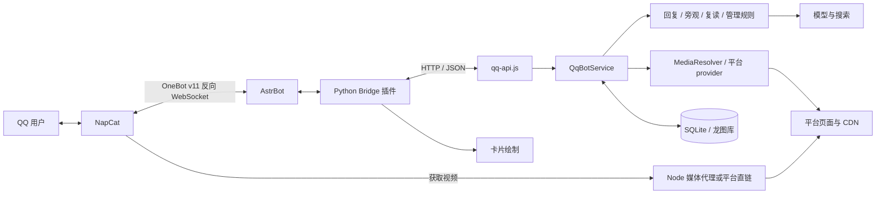
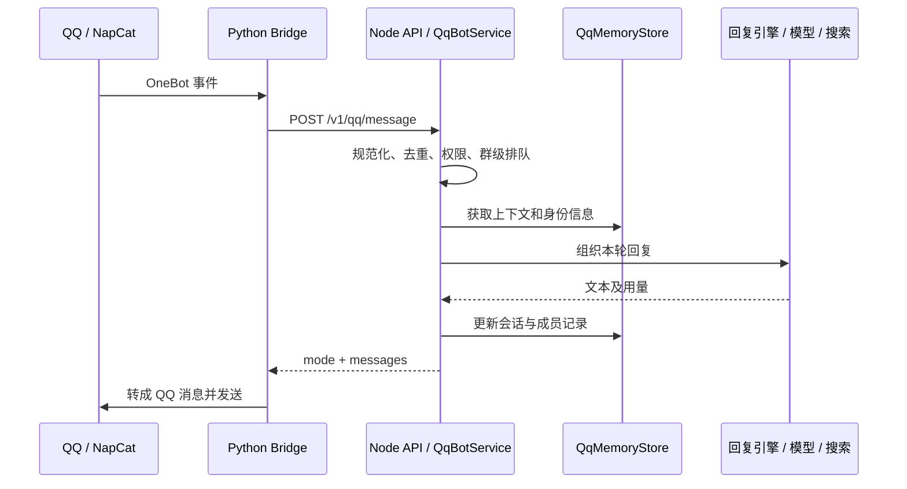
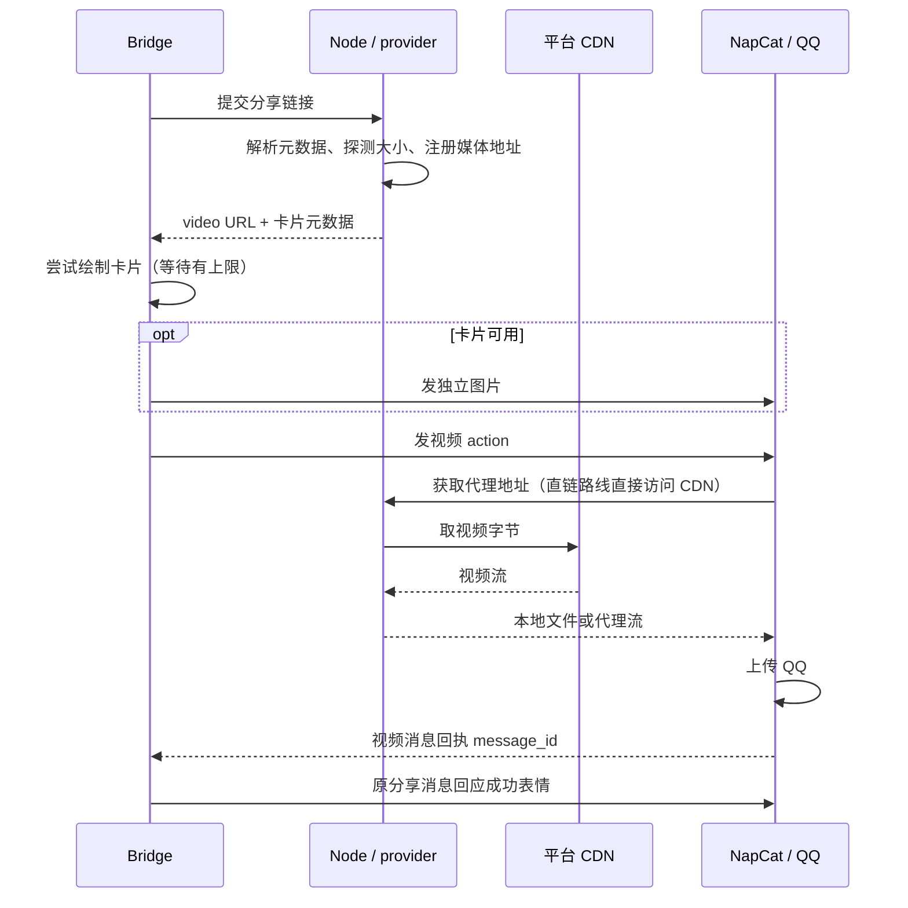

# QQ 龙图机器人的架构、设计与学习指南

> 适用仓库：`wecom-meme-bot`
>
> 整理日期：2026-09-18
>
> 适合读者：第一次接触 Node.js 服务，希望从 QQ 中的实际输出理解项目的人

第一次接触进程、模块、Promise、HTTP、Buffer 和数据库时，请先阅读[从零看懂 QQ 机器人](nodejs-foundations-explained.md)。本文把这些概念放回当前运行链路；安装、登录和更新操作见 [QQ 部署文档](QQ_DEPLOYMENT.md)。文中配置值若未特别注明，均指代码默认值，不代表云服务器一定使用该值。

## 0. 先认清入口和输出

仓库同时保留 QQ 和企业微信，但入口不同：

| 平台 | 启动命令 | Node 入口 | 消息连接 |
| --- | --- | --- | --- |
| QQ | `npm run start:qq` | `src/qq-api.js` | NapCat ↔ AstrBot，再由 Bridge 请求 Node HTTP 接口 |
| 企业微信 | `npm start` | `src/index.js` | Node 通过企业微信 SDK 建立长连接 |

本文只沿 QQ 主链路解释。QQ 后端要求 **Node.js 22.5+**，使用原生 HTTP 服务和 SQLite。不要因为没看到 Express 就认为它没有 HTTP 服务，也不要用企业微信 `media_id` 上传流程解释 QQ 发视频。

从用户看到的结果反推业务，是最容易读懂这个项目的方式：

| 输入场景 | QQ 里的输出 | 主要负责的模块 |
| --- | --- | --- |
| 明确点名、引用机器人或私聊提问 | 文本，按路由搭配龙图；被动群回复有引用/艾特 | `qq-service`、`reply-engine`、Bridge |
| 普通群聊 | 静默记录，或独立发一条主动回复 | `active-reply`、`qq-memory-store` |
| 两个不同真人连续重复纯文本 | 同一轮只复读一次 | `repeat-detector` |
| 视频分享 | 独立简介卡片，再发视频；视频有实际回执后回应成功表情 | `media-resolver`、provider、Bridge、NapCat |
| 图文分享 | 独立简介卡片，再发只含图片的合并聊天记录 | provider、`video_card.py`、Bridge |
| 内容已删除 | 平台识别到删除状态后提示内容删除 | provider、`qq-service` |
| 视频过大/提取超时 | 尽量保留卡片，再发限制提示 | `media-limits`、`media-resolver`、Bridge |

开关、群权限、主动回复节流、平台接口和 QQ 连接都会影响结果。空输出可以是有意静默，也可以是解析失败，必须结合返回的 `mode` 和日志判断。

## 1. 三个主体怎样协作



**NapCat** 维持 QQ 登录，接收事件，并执行发送图片、视频、合并转发、原生表情回应等 OneBot 动作。

**AstrBot + Bridge** 是 Python 一侧。AstrBot 接收 OneBot 事件，Bridge 从消息段中提取文本、艾特、引用、分享卡片，调用 Node，再把 Node 的返回结果变成 QQ 消息。卡片图片也在这一侧绘制。

**Node QQ 后端** 决定怎样处理消息：检查权限、去重、记忆、判断是否接话、调用回复引擎，或者解析分享链接。它返回“要发送什么”，通常不直接登录 QQ。

provider 是视频平台的解析适配器，有的在 Node 内，有的是独立 HTTP 服务。抖音 provider 通过持久化浏览器登录态取数，小红书可使用配置的 provider；两者都不是 AstrBot 的聊天模型。

`qq-bot`、`astrbot`、`napcat`、`douyin-provider` 这些名称通常是 Docker 网络里的服务名/别名。在笔记本浏览器中直接访问 `http://qq-bot:8787`，并不等价于在 AstrBot 容器中访问它。

## 2. Node 后端如何启动

入口 [`src/qq-api.js`](../src/qq-api.js) 中的 `startQqApi()` 大致完成以下步骤：

1. 用 dotenv 读取 `QQ_ENV_FILE` 指定文件，未指定时读项目根目录 `.env.qq`。
2. 校验 `QQ_API_TOKEN`，要求至少 32 字符并拒绝示例占位值。
3. `createQqRuntime()` 创建图库、QQ 记忆库、用量统计、模型/搜索客户端、媒体解析器和业务服务。
4. 恢复会话，读取图库状态，建立 HTTP 路由。
5. 监听地址和端口。代码默认 `127.0.0.1:8787`；QQ Compose 设为容器内 `0.0.0.0:8787`，不向宿主机发布 8787。
6. 注册退出信号：关闭 HTTP，刷新记忆，关闭数据库和媒体解析器。

这里的“组装”体现了依赖注入：`QqBotService` 需要记忆、模型、解析器等能力，由入口创建后传进去。测试时可以把其中某个能力换成假对象，而不是每次都请求真实模型。

监听端口和活跃连接会让事件循环持续运行，不需要自己写一个无限 `while`。退出时也需要收尾，不能把杀进程理解成正常完成所有任务。

### 2.1 关键 HTTP 接口

| 接口 | 调用者和用途 | 能证明什么 |
| --- | --- | --- |
| `GET /healthz` | 容器健康检查、运维检查，无需 Bearer Token | Node 能返回状态；其中 `model_configured` 表示有模型配置，不是模型调用已成功 |
| `POST /v1/qq/message` | Bridge 提交一次输入，需要 `QQ_API_TOKEN` | 返回业务结果，不等于 QQ 已送达 |
| `GET /v1/qq/media/<随机ID>` | NapCat 获取视频文件或代理流 | 媒体地址有效且当前可以取数；地址会过期 |
| `GET /v1/qq/usage` | 查询模型/搜索用量，需要令牌 | 统计调用、token、缓存命中及估算成本 |
| `GET /v1/qq/media-usage` | 查询媒体解析统计，需要令牌 | 解析结果、耗时和字节统计，不是最终 QQ 发送回执 |

媒体随机 ID 和 QQ 的 `message_id` 不同：前者定位临时媒体资源，后者标识 QQ 消息。不要把带鉴权信息的原始日志、cookie 或令牌粘进群里排障。

## 3. 消息和返回结果长什么样

### 3.1 输入：把复杂 OneBot 消息转成业务字段

QQ 一条消息可能同时包含文本、图片、艾特、引用、JSON/XML 分享卡。Bridge 先提取这些内容，向 Node 发送 JSON。以下是简化示意，省略了成员、图片和引用等字段：

```json
{
  "message_type": "group",
  "message_id": "123456",
  "group_id": "10001",
  "user_id": "20001",
  "bot_user_id": "30001",
  "text": "龙图是什么"
}
```

QQ 号和消息 ID 是标识符，不用于加减运算，用字符串表达更直观。`normalizeQqPayload()` 会把外部 `message_type` 等字段转换为内部 `messageType` 等形式，限制长度并补充默认值。规范化可以避免每个业务模块重复猜测输入类型。

上例只展示字段形状；是否明确艾特机器人还需要实际的艾特信息，不能只靠 `text` 中写一个“@”模拟。

### 3.2 输出：mode 选处理路线，messages 描述内容

一个视频结果的简化形状：

```json
{
  "ok": true,
  "mode": "media",
  "messages": [{
    "type": "video",
    "url": "http://qq-bot:8787/v1/qq/media/demo-id",
    "provider": "bilibili",
    "title": "视频标题",
    "author": "视频作者",
    "avatarUrl": "https://example.com/avatar.jpg",
    "coverUrl": "https://example.com/cover.jpg",
    "description": "视频简介",
    "tags": ["示例标签"]
  }]
}
```

这里的 URL 是示意地址，不能用来下载真实视频。`mode` 不会直接展示给群友，而是告诉 Bridge 走哪条发送路线；`ok: true` 也不表示视频已经出现在群里。

| 典型 mode / 消息类型 | Bridge 如何理解 |
| --- | --- |
| `observed`、其他静默结果 / 空 `messages` | 不发普通回复 |
| `repeat-reply` / 文本 | 原样复读本轮文字，不请求模型生成 |
| `media` / `video` | 尝试卡片，然后发送视频并检查回执 |
| `media-gallery` / `forward` | 卡片独立发送；图片组成合并转发 |
| `media-unavailable` / 文本 | 显示内容已删除等已知原因 |
| `media-unavailable` / `media-limit` | 利用已有元数据画卡片，再发过大/超时提示 |
| `media-unavailable` / 空消息 | 一些普通解析失败会走此分支，可能只有失败表情 |

返回值是两个语言之间的约定。修改 Node 字段时，需要一起检查 Python Bridge 的消费逻辑；Node 单元测试通过，仍不足以证明卡片和视频发得出来。

## 4. 普通回复、旁观和复读

### 4.1 谁决定是否接话

群普通消息不等于必须回答。系统将“是否值得参与”和“用什么人格回答”分开：

- `must`：明确点名/引用机器人，或规则判定的紧迫风险等，应进入回复路径。
- `may`：可以接话的公开提问或新信息，继续受概率、冷却、群活跃度、退场和上下文价值限制。
- `no`：不合适参与，保持静默，按配置记录旁观语境。

不是每条旁观都一定调用模型；前置规则和节流可以跳过调用。真人对话窗口、peer Bot 连续回复上限和超管 `/stop` 也会影响后续参与。

最终生成仍交给既有 Node 回复引擎，使用 [`config/system-prompt.md`](../config/system-prompt.md) 等角色约束。判定器的中性提示只负责判断，不会替换聊天人格；降低旁观频率也不等于换角色。

Bridge 在进入消息处理时标记该事件由插件接管，阻止 AstrBot 默认 LLM 接手，并在结束时停止后续事件链。它不能在所有回复产出之前一律调用 `stop_event()`，否则框架可能连本插件的回复也跳过。排障时要区分“拦默认模型”和“拦整个发送阶段”。

### 4.2 一条普通回答的顺序



被动群回复会引用原消息，并按输入选择艾特目标；主动插话独立发送。搜索、思考或质量复核可能使一轮产生多次模型调用，不能把“收到一条消息”直接当成“调用一次模型”。

### 4.3 两种去重解决不同问题

**事件去重**：`消息类型:目标ID:message_id` 是进程内去重键，默认十分钟。网络重复投递同一个事件时避免重复处理；进程重启后丢失，不是持久化的严格幂等保证。

**单轮复读**：[`RepeatDetector`](../src/repeat-detector.js) 对纯文本做 NFKC 与空白规范化。两个不同真人连续发送同一句时触发一次，之后的跟读不会再触发，直到其他内容打断。它没有按秒到期的复读窗口；同一个人刷屏不算两票，机器人自己相同的回声也不重新开轮。图片、引用、艾特和命令等会打断普通复读轮次。

### 4.4 权限和命令

群白名单决定是否处理该群；媒体排除决定是否监测分享，它们不是同一开关。图库管理采用管理员 `/add`、`/tag`、`/del`，还有超管 `/stop` 和相应用量报告命令；未知斜杠命令不会交给默认模型兜底。

按群的平台白名单 `QQ_MEDIA_GROUP_ALLOWED_PROVIDERS` 比整群媒体排除更精确，优先于 `QQ_MEDIA_EXCLUDED_GROUPS`。Node 与 Bridge 两侧要一致，否则可能出现插件已回应“开始解析”，后端却不放行的情况。

## 5. 分享解析、卡片和真正的视频发送

### 5.1 三个平台的路线

| 平台 | 常用解析来源 | 常用视频交付 |
| --- | --- | --- |
| B 站 | `bilibili-provider.js` 原生播放 API，优先选择合适 MP4，常用 720P | Node 代理；同一视频可尝试备用 CDN |
| 小红书 | `xhs-provider.js` 对接配置的 provider，区分视频/图文 | 视频大小探测后通常给 NapCat 直链；图文返回图片数组 |
| 抖音 | `douyin-provider.js` 对接 Python provider，复用 Chromium profile 登录态 | Node 代理携带需要的请求头取流 |

解析器先识别受支持分享来源，不是把任意 HTTPS 链接都当视频。provider 不可用、数据不完整或格式不适合时，可能进入公开页面或 `yt-dlp` 回退；不是三个平台都先下载完整 MP4 再返回。

B 站多 P 通过视频页的 `p` 或播放器页的 `page` 参数选择 `pages` 中对应的 `cid`，短链保留目标页的分 P。没指定默认 P1，卡片使用该分 P 的标题与时长。缓存键区分各 P；B 站回退只使用保留分 P 的 `yt-dlp` 路线，不读取可能指向默认 P1 的通用页面视频。

`MediaResolver` 会缓存解析结果，也用 `inflight` 让同一进程里正在解析的同一资源复用任务，减少跨群重复解析。卡片缺头像/封面属于可选元数据失败，不应把本来可播放的视频判成不可用。

### 5.2 卡片应该展示什么

卡片由 [`video_card.py`](../astrbot_plugin_longtu_bridge/video_card.py) 绘制，使用平台原生 logo 素材、**原视频作者**的圆形头像和昵称。标题、正文、标签放在卡片上；B 站显示视频发布时间，按北京时间展示。封面根据横竖图适配。

图文使用首图或多图预览；最多九张预览，超出用 `+N` 标记剩余数量。卡片单独发送，合并聊天记录只包含原图节点。小红书解析结果自身仍有图片数量上限，当前最多取 18 张，预览不代表额外抓取了无限张原图。

如果 emoji 显示方框，需要区分：源文本是否解析出来、字体是否覆盖字符、绘制库是否支持对应 emoji。浏览器能显示某个表情，不保证 Python 字体渲染能原样显示。先检查卡片字段和实际渲染环境，再决定修解析还是修字体。

### 5.3 一次视频分享的发送顺序



Node 远程媒体注册还会启动后台预下载。NapCat 来取时，最多短暂等待约 500ms 看本地文件是否已就绪；已就绪就提供文件，否则回退流式代理。后台预下载和代理可能重叠，不能把它说成任何情况下都只有一次下载。代理还包含备用 CDN、断流重连和 Range 校验。

卡片等待最多 12 秒，失败继续视频，当前不补发独立标题。视频直接调用 OneBot 并核对有效回执；仅把消息 `yield` 给框架、或 Node 返回 `ok`，都不足以判定成功。成功回应表情默认 ID 为 `478`，失败为 `479`，可配置。视频发送失败会尝试回应失败表情和引用提示，不会因没抛到上层就误报成功。

### 5.4 500 MiB、提取八分钟和发送八分钟分别管哪里

| 限制 | 当前边界 | 不包含/不能推出什么 |
| --- | --- | --- |
| 单视频大小 | `500 * 1024 * 1024` 字节，即 500 MiB，用户文案写 500MB | 不是视频播放时长；图文不走视频 size 拦截 |
| 提取时间 | 解析器取得并发名额后建立 480 秒 deadline；较短 provider/下载超时可以先发生 | 不是从群友按发送起到 QQ 送达的统一八分钟 |
| 视频发送回执 | Bridge 的 OneBot 调用单独等待最多 480 秒 | 超时不证明 QQ 后台上传已取消 |
| 卡片等待 | 最多 12 秒，卡片失败继续发视频 | 不应把视频判为失败 |
| Node 缓存容量 | 默认目录容量 512 MiB | 不是单视频允许 512 MiB |

拿到 provider 声明大小或通过探测得到可靠 `Content-Length` 时，先判大小再完整下载。取不到大小时不能编造值，下载路径会尽量按累计字节兜底；直链交给 NapCat 后不经过 Node 全程字节计数。具体能力要按路线判断。

视频自身播放一小时不是拒绝理由。码率、分辨率和压缩方式决定文件大小；网络决定传输时间。`QQ_MEDIA_DOWNLOAD_TIMEOUT_SECONDS` 默认 120 秒，一些 provider 还更短，因此“最多八分钟”不是保证所有请求一定会等满八分钟。

### 5.5 失败输出不是只有一种

- 明确删除：返回“这个分享的内容已被删除，无法抓取。”；只有解析拿到相应状态才能判断，网络超时不能直接当成删除。
- 过大/提取超时：返回 `media-limit`，用已拿到的元数据尝试卡片并提示前往平台观看。
- 普通解析失败：一些分支返回空消息，只通过结果表情和日志体现；不能宣称每次失败都会有说明文字。
- 卡片失败：继续视频，不另发标题作为卡片替代。
- QQ 视频发送失败：检查回执后反馈。等待超时会注明“可能仍在发送”，避免误导用户重复提交。

## 6. 并发与排队：为什么慢分享会影响下一条

Node 单线程也会有并发：A 等网络时，B 可以开始运行。但“都能开始”不代表状态顺序正确，所以当前代码有多层控制。

| 控制 | 范围 | 用途 |
| --- | --- | --- |
| `QqBotService.runGroupExclusive` | 同一群的 Node 业务处理，包含媒体解析 | 保持群内处理状态顺序；慢解析可能使下一条排队 |
| `QqMemoryStore.runExclusive` | 同一会话的记忆操作 | 避免交错读取旧历史和写入顺序问题 |
| `MediaResolver.maxConcurrent` | 默认最多两个媒体解析任务 | 控制解析压力，不覆盖后续所有视频上传 |
| `inflight` | 同一规范化媒体资源正在进行的解析 | 减少同一进程重复取数 |
| Bridge/NapCat 发送 | Node 返回之后继续发生 | 不属于 Node 的群队列锁 |

Promise 队列把当前任务接在上个任务后面，失败也要允许后续任务继续。它不是操作系统线程锁，也不是磁盘消息队列，重启不会自动恢复尚未完成的排队任务。

当前只保证一次分享先尝试卡片再发送它的视频。多次分享在 Node 返回后的下载/上传可能重叠，不保证整个群所有视频严格按到达顺序发出。定位“卡住”时先看卡在队列、解析、代理下载还是 QQ 上传，不要一概扩大并发。

## 7. 状态、缓存和磁盘生命周期

| 数据 | 当前位置/形式 | 生命周期与清理边界 |
| --- | --- | --- |
| 消息去重、复读状态、执行队列 | Node 内存 Set/Map/Promise | 重启丢失；去重默认十分钟，复读按轮次结束 |
| QQ 会话、摘要、成员信息 | `data/qq-memory.sqlite` | 近期原文默认最多 30 天并按数量裁剪；成员画像独立保存 |
| 龙图信息、关键词、抽图进度 | `data/longtu-library.sqlite`，动态文件在 `data/longtu-library/` | 持久化业务数据，不作为视频缓存清理 |
| 模型/搜索用量 | `data/qq-usage.sqlite` | 用于日报和成本统计 |
| 媒体解析统计 | `data/qq-media-usage.sqlite` | 不能替代最终发送记录 |
| 媒体解析结果/短期媒体地址 | Node 内存与媒体注册表 | 默认 600 秒；重启或过期后可能不可用 |
| Node 临时视频 | 默认 `/tmp/longtu-media-cache` | TTL 默认 600 秒，容量默认 512 MiB，定时扫描默认约一分钟 |
| Bridge 封面字节缓存 | Python 内存 | 当前 TTL 六小时、最多 64 项，与视频有效性分开 |
| 抖音浏览器登录态 | `data/douyin-profile` 挂载目录 | 持久化，不作为临时下载清理 |
| NapCat 临时视频 | 线上配置的 `NapCat/temp` 目录 | 单独的每日清理任务，不由 Node 缓存 TTL 负责 |

SQLite 的 `-wal`、`-shm` 不是普通垃圾文件。清理磁盘应先确认具体目录用途，保留数据库、QQ 登录数据、浏览器 profile 和图库。Docker 构建缓存又是另一类占用，不应混成一项总叫“缓存”。

项目提供 [`longtu-napcat-temp-cleanup.timer`](../services/systemd/longtu-napcat-temp-cleanup.timer)：北京时间每天 9 点运行，清理当天零点以前的临时视频，保留当天文件和正在使用的文件。timer 需要在服务器安装并启用，仓库里有文件不代表服务器自动生效。操作见[每日清理说明](QQ_DEPLOYMENT.md#napcat-临时视频每日清理)。

## 8. 模型缓存、峰谷与成本

模型缓存命中是供应商复用输入前缀的计算，不是本地复用一条回答。当前请求会尽量把共享上下文、固定系统提示和稳定部分放在前面，再追加变化较大的内容；实际构造看 [`chat-client.js`](../src/chat-client.js)。优化前缀不应删改人格或混用不同群成员身份。

缓存量从模型响应的 `prompt_cache_hit_tokens`、`prompt_tokens_details.cached_tokens` 等字段读取。按 token 加权的命中率可理解为：

```text
统计范围内缓存命中的输入 token 总数 / 输入 token 总数
```

它不是“命中请求数 / 请求数”，也与视频解析缓存无关。高频变化的提示前缀、较短请求、不同调用路径都可能使命中率低；先看用量记录和请求组织，再判断原因。

[`qq-usage-tracker.js`](../src/qq-usage-tracker.js) 中当前峰段定义为北京时间**工作日 09:00–12:00、14:00–18:00**。这一定义用于项目内的计价估算与大群静默观测策略：高峰可降低被动判定频率、缩短部分旁观上下文，并控制摘要等后台调用预算。实际阈值由 `.env.qq` 覆盖；代码里的价格常量不是供应商实时账单，供应商调价时仍要同步。

成本需要分别看模型输入/输出 token、搜索调用、平台 provider、视频带宽，以及浏览器/图片处理的 CPU、内存和磁盘。减少卡片生成耗时，不会直接提高模型输入缓存命中率。

## 9. 按职责阅读源码

| 节点 | 职责 | 阅读时带着的问题 |
| --- | --- | --- |
| [`qq-api.js`](../src/qq-api.js) | 配置、依赖组装、HTTP 路由、退出 | 一个请求怎样进入服务？ |
| [`qq-service.js`](../src/qq-service.js) | QQ 输入规范化、权限、路由、结果编排 | 为什么这条有回复，那条静默？ |
| [`active-reply.js`](../src/active-reply.js) | 主动参与判定 | 限流发生在调用模型前还是后？ |
| [`repeat-detector.js`](../src/repeat-detector.js) | 单轮复读状态 | 谁在什么时机清除 handled？ |
| [`reply-engine.js`](../src/reply-engine.js) / [`chat-client.js`](../src/chat-client.js) | 生成、搜索编排、质量复核、模型接口 | 人格、历史和当前消息如何组合？ |
| [`qq-memory-store.js`](../src/qq-memory-store.js) | SQLite 记忆、身份、队列 | 当前群和成员信息如何隔离？ |
| [`longtu-library.js`](../src/longtu-library.js) | 图库、管理、抽图状态 | 哪些是磁盘文件，哪些是数据库记录？ |
| [`media-resolver.js`](../src/media-resolver.js) / [`media-limits.js`](../src/media-limits.js) | 解析、缓存、大小和耗时边界 | 失败在返回地址前还是后？ |
| [`media-stream-proxy.js`](../src/media-stream-proxy.js) | 视频代理、备用 CDN、断流恢复 | 响应头到达后是否仍可能断流？ |
| [`main.py`](../astrbot_plugin_longtu_bridge/main.py) / [`video_card.py`](../astrbot_plugin_longtu_bridge/video_card.py) | QQ 协议适配、图片绘制、实际发送 | 成功依据是否是真实回执？ |
| [`services/douyin-provider/`](../services/douyin-provider/) | 浏览器解析服务 | 登录态存在哪里？ |

图库离线导出、OCR 和索引脚本在 `scripts/`。当前运行时也有 OCR 和卡片绘制，不能认为所有图像计算都在离线阶段完成。

## 10. 从本地实验到真实部署

### 10.1 不登录 QQ 先学什么

在项目根目录：

```bash
node --version
npm ci
node --test test/repeat-detector.test.js
```

确认 Node 至少 22.5。先看一个小模块的输入输出，再运行[零基础文档第 19 节](nodejs-foundations-explained.md#19-可以亲手运行的最小实验)的复读和 HTTP 实验。HTTP 实验使用真实接口工厂、假的业务服务，不需要模型密钥、不会发送 QQ 消息。

需要验证自己修改过的范围时，可以选择：

```bash
node --disable-warning=ExperimentalWarning --test test/qq-memory-store.test.js
node --disable-warning=ExperimentalWarning --test test/qq-service.test.js
python3 -m unittest discover -s test -p 'test_bridge_media_delivery.py'
```

`npm test` 运行 Node 测试集合；Python 测试要按其环境单独执行。以上测试使用替身或受控环境，不是完整 QQ 端到端验证。触及 AstrBot 的框架行为时，还要在对应 AstrBot 环境中验证集成。

### 10.2 再接真实服务

完整步骤以 [QQ 部署文档](QQ_DEPLOYMENT.md) 为准：准备配置 → 启动相应容器 → 在 AstrBot 配置 OneBot → NapCat 登录并连接 → 确认 Bridge 到 Node 的认证与网络 → 验证实际输出。

两套 Compose 不应混用：

| 文件 | 适用环境 |
| --- | --- |
| [`docker-compose.qq.yml`](../docker-compose.qq.yml) | 仓库管理的完整 QQ 环境，包含 AstrBot、NapCat、Node 后端和小红书服务等 |
| [`docker-compose.server.yml`](../docker-compose.server.yml) | 云端已有 AstrBot/NapCat，在其外部网络启动 Node 后端及抖音 provider |

Dockerfile 默认 `CMD` 仍是企微 `npm start`，QQ Compose 会覆盖为 `npm run start:qq`。`config/` 和内置图库只读挂载，`data/` 持久化挂载，provider 的 profile 另有挂载。

修改环境变量通常需要重建容器才能重新注入；源码如果打进镜像，也需要重新构建。Bridge 安装/挂载在 AstrBot 一侧，改 Node 镜像不会自动更新已安装的 Python 插件。文档修改本身无需重启机器人。

### 10.3 一次实际验收要看哪些结果

在约定测试群中核对：普通明确点名回复、两人复读只触发一次、一个视频的独立卡片和视频回执、一个图文的独立卡片和只含图片的合并记录。大小与超时等异常可先用受控测试验证，不必为了验收故意在群里上传超大文件。

如果只确认 `/healthz` 或 Node JSON，验收只完成了后端层；如果只看到卡片，视频层仍未完成。

## 11. 从 QQ 表现开始排障

先记录**群号、原消息 ID、平台链接/内容 ID、发送时间**，围绕同一条分享关联日志。不要只凭“最后一条”或一次重启猜原因。

| 现象 | 优先看哪里 | 关键判断 |
| --- | --- | --- |
| 普通文本也不回应 | NapCat 登录、OneBot 连接、AstrBot Bridge 日志、Node 健康与模型状态 | Node 没收到请求，还是收到了但静默/异常？ |
| 有解析表情，没卡片没视频 | Bridge HTTP 结果、群媒体开关、provider 日志、解析队列 | 被排除、解析失败，还是尚未拿到并发名额？ |
| 卡片没头像/正文 | provider 返回字段、Bridge 图片拉取、字体与卡片日志 | 字段缺失还是绘制丢失？ |
| 卡片有了，视频迟迟没有 | Bridge 视频发送开始、Node 代理字节日志、NapCat 上传和回执 | 解析通常已经返回，重点看取流与 QQ 上传 |
| 首次成功，再转发失败 | 缓存 TTL、临时 URL 是否过期、Node 是否重启、源站登录态 | 命中旧元数据不等于旧媒体地址还有效 |
| 一条慢分享后同群都慢 | 群级队列、解析耗时、provider 超时 | 后续请求在等队列还是共用带宽？ |
| 有“发送等待超时”，稍后仍出视频 | NapCat 历史与有效消息回执 | 本地等待结束不等于远端已取消 |
| 磁盘持续上涨 | 分开统计 Docker 构建缓存、Node 临时目录、NapCat temp、持久化数据 | 每一类由不同清理机制管理 |

### 11.1 云端常用的只读检查

在服务器项目目录、已有权限下运行：

```bash
docker compose --env-file .env.qq -f docker-compose.server.yml ps
docker compose --env-file .env.qq -f docker-compose.server.yml logs --since 20m --tail 300 qq-bot
docker logs --since 20m --tail 300 astrbot
docker logs --since 20m --tail 300 napcat
docker compose --env-file .env.qq -f docker-compose.server.yml exec -T qq-bot node -e "fetch('http://127.0.0.1:8787/healthz').then(r => r.json()).then(console.log)"
```

`astrbot`、`napcat` 按实际容器名替换；本地完整部署则用 `docker-compose.qq.yml`。命令输出可能包含分享地址和群消息，排障记录只保留所需部分并去除凭证。

对于视频发送，Bridge 日志中的 `target` 和 `source_message_id` 可以把“视频发送开始”“视频发送成功”或“视频发送未成功”串起来。分别计算解析耗时、视频取流耗时、实际发送回执耗时，再确定优化哪一段。

## 12. 配置阅读地图

以下只列配置入口，具体值和格式见 [`.env.qq.example`](../.env.qq.example) 与 [QQ 部署文档](QQ_DEPLOYMENT.md)。

| 配置类别 | 典型名称/位置 | 影响范围 |
| --- | --- | --- |
| Node HTTP | `QQ_API_HOST`、`QQ_API_PORT`、`QQ_API_TOKEN` | Bridge 能否访问业务接口 |
| OneBot | `ONEBOT_TOKEN`、NapCat/AstrBot 配置 | QQ 事件和发送动作的连接 |
| 模型与搜索 | `LLM_*`、`WEB_SEARCH_*` | 普通回复能力及成本 |
| 群与管理员 | `LONGTU_QQ_ALLOWED_GROUPS`、`LONGTU_QQ_ADMIN_USERS` | 处理范围和管理权限 |
| 主动回复/复读 | `LONGTU_QQ_ACTIVE_REPLY_*`、`LONGTU_QQ_ENGAGEMENT_*`、`LONGTU_QQ_REPEAT_*` | 参与频率与规则；复读不再使用时间窗口 |
| 用量和峰谷 | `QQ_USAGE_*` | 统计、预算、大群旁观策略 |
| 媒体 | `QQ_MEDIA_*`、Bridge 对应设置 | 平台范围、解析、缓存、表情和转发 |
| provider 登录 | provider 配置、cookie 文件、浏览器 profile | 平台内容访问，不改变聊天人格 |
| 角色约束 | `config/system-prompt.md` 等 | 最终回答风格与身份约束 |

更改配置前，先从读取位置追到使用位置。配置名还在旧文件里，并不能证明当前代码继续使用它；同样，修改本机示例不会更新线上进程。

## 13. 推荐学习顺序

1. 运行复读实验，读 `RepeatDetector`，理解 Map、Set 和状态转换。
2. 运行本地 HTTP 实验，理解请求头、JSON、鉴权与返回值。
3. 沿 `qq-api → qq-service → reply-engine` 看一条普通回复，补齐 async/await 和依赖注入。
4. 读 `QqMemoryStore`，理解数据库、会话隔离和 Promise 队列。
5. 沿 `MediaResolver → Bridge → NapCat` 看一条视频，区分元数据、文件传输和发送回执。
6. 最后结合 Compose、日志和用量统计，理解跨进程部署、超时和缓存生命周期。

每一轮只追一个问题，例如“为什么这条消息静默”“为什么第三个人复读没有再触发”“为什么卡片到了视频还没到”。能指出负责该结果的模块、状态和证据，比一次记住所有配置更有用。
