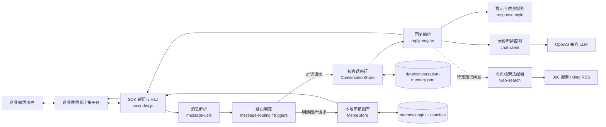
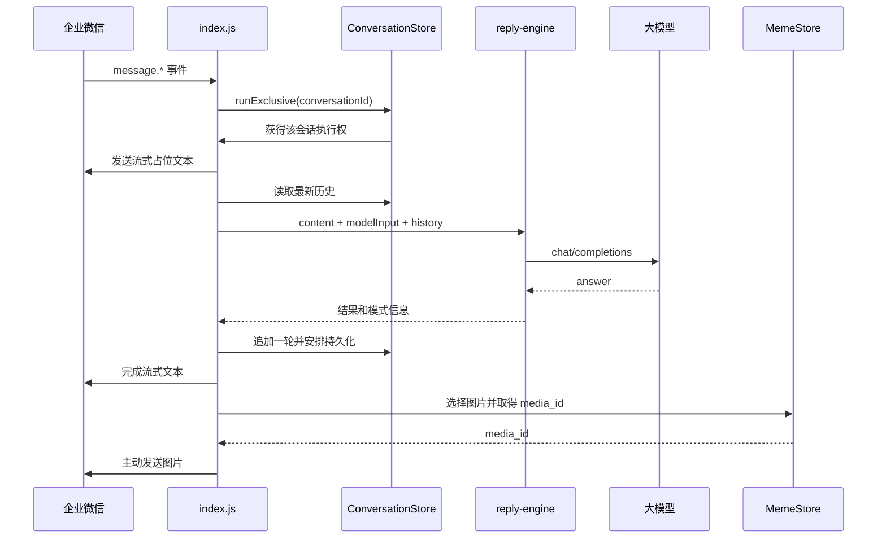

# 企业微信龙图机器人的架构、设计与 Node.js 学习指南

> 适用仓库：`wecom-meme-bot`  
> 整理日期：2026-07-30  
> 适合读者：正在学习 Node.js、还没有服务端项目经验的开发者

如果你还不熟悉进程、模块、回调、Promise、事件循环、HTTP、`Buffer` 等词，请先阅读[从零解释 Node.js 基础概念](nodejs-foundations-explained.md)。本文主要负责把这些概念放回完整项目架构中。

## 0. 先说结论

这个项目不是常见的 Express/Koa HTTP 服务。它是一个长期运行的 Node.js 进程，通过企业微信 SDK 主动建立 WebSocket 长连接，然后用事件监听器处理企业微信推送的消息。

可以把它概括成一句话：

> 企业微信消息进入后，程序先判断是“直接发图”还是“生成对话”；对话可能调用大模型和有限的网页检索，最后通过同一条企业微信连接返回文本和本地审核图片。

项目最值得学习的 Node.js 知识包括：

- ESM 模块、npm 脚本和环境变量；
- 事件驱动编程、Promise、`async/await` 与事件循环；
- `fetch`、超时取消和外部 API 适配；
- 文件系统、`Buffer`、哈希和本地 JSON 持久化；
- `Map`/`Set`、TTL 缓存和进程内状态；
- 用 Promise 队列实现“同一会话串行、不同会话并行”；
- 依赖注入和 Node.js 内置测试框架；
- 进程信号、优雅退出和 Docker 部署。

本文将用户原问题中的“价格”主要按“架构”理解，同时在第 9 节补充运行成本与调用次数的估算方法。

## 1. 系统边界

### 1.1 它负责什么

- 连接并认证企业微信智能机器人长连接；
- 接收文本、语音、图片和图文混排消息；
- 提取文字、识别图片、划分群聊与私聊会话；
- 根据规则选择直接发图、普通问答或特定风格回复；
- 调用 OpenAI 兼容的大模型接口；
- 在特定知识类问题中调用受限网页检索；
- 从审核过的本地图库选择图片，上传为企业微信临时素材并发送；
- 在本机 JSON 文件中保存有界的短期会话历史。

### 1.2 它不是什么

- 没有 Express/Koa，也没有监听 HTTP 端口；
- 没有数据库、消息队列、用户后台或管理页面；
- 不提供浏览器可访问的 REST API；
- 不是多实例服务：企业微信同一机器人同时只能保持一个有效长连接；
- 不是完整的图片识别在线服务，图片索引和审核主要属于离线工具链。

## 2. 总体架构



### 2.1 分层理解

从外向内看，项目可以分为五层：

| 层 | 作用 | 主要文件 |
| --- | --- | --- |
| 外部适配层 | 对接企业微信、大模型、搜索站点 | `index.js`、`chat-client.js`、`web-search.js` |
| 应用编排层 | 决定一次消息要按什么顺序完成哪些动作 | `index.js`、`reply-engine.js` |
| 领域规则层 | 触发词、消息路由、风格识别和质量检查 | `triggers.js`、`message-routing.js`、`response-style.js` |
| 状态与资源层 | 会话历史、本地图片、缓存和持久化 | `conversation-store.js`、`meme-store.js` |
| 配置与数据层 | Prompt、知识、白名单、别名和图片 | `config/`、`data/`、`memes/`、`.env` |

这不是严格的“教科书分层架构”，因为 `index.js` 同时承担了组装依赖、注册事件和部分业务编排。但对一个规模较小的机器人服务来说，这个组织方式仍然容易理解。

## 3. 启动过程

入口是 [`src/index.js`](../src/index.js)，`npm start` 最终执行 `node src/index.js`。

启动顺序如下：

1. `import 'dotenv/config'` 把 `.env` 加载到 `process.env`。
2. 检查企业微信 `BotID` 和 `Secret`，缺失就用非零状态退出。
3. 根据当前文件位置计算项目根目录，建立配置和数据文件的绝对路径。
4. 创建 `MemeStore`、`ConversationStore` 和 `LongtuWebSearch`。
5. 先从磁盘恢复会话，再用 `Promise.all` 并行加载角色 Prompt、知识文档和成员别名。
6. 创建大模型客户端和企业微信 WebSocket 客户端。
7. 注册连接、消息、进群、重连、断开、错误等事件监听器。
8. 调用 `client.connect()`，让进程进入长期监听状态。
9. 注册 `SIGINT`/`SIGTERM`，退出前等待会话持久化并断开连接。

这里有两个初学者容易忽略的点：

- 项目使用 ESM，因此可以在模块顶层直接使用 `await`；
- `client.connect()` 之后没有一个显式的 `while` 循环，但 WebSocket、定时器和事件监听器仍会让 Node.js 事件循环保持活跃。

## 4. 一条消息如何被处理

### 4.1 公共入口

四种消息事件都复用同一个 `receiveMessage`：

```js
client.on('message.text', receiveMessage);
client.on('message.image', receiveMessage);
client.on('message.voice', receiveMessage);
client.on('message.mixed', receiveMessage);
```

这体现了一个重要设计习惯：先把不同外部事件归一到统一入口，再在内部判断数据类型。

### 4.2 路由顺序

`handleIncomingMessage` 的判断顺序非常重要：

1. 按 `msgid` 做十分钟的进程内去重；
2. 消息包含图片时，直接走发图流程；
3. 从文本、语音或 mixed 消息中提取文字；
4. 没有有效文字时忽略；
5. 计算会话 ID，并读取历史；
6. 如果是明确的龙图请求且不是攻击语境，只回复图片；
7. 其他情况进入对话流程。

| 输入/条件 | 结果 | 大模型 | 网页检索 |
| --- | --- | --- | --- |
| 单图或 mixed 中含图 | 直接返回一张审核龙图 | 否 | 否 |
| 明确龙图指令，且不是攻击语境 | 直接返回一张审核龙图 | 否 | 否 |
| 攻击内容或对线延续 | 生成短回复，必要时重试一次 | 1～2 次 | 否 |
| 询问龙图出处、含义等知识 | 注入本地知识和搜索摘要后回答 | 通常 1 次，可能复核 | 1 次搜索流程 |
| 普通外部事实、网络梗、流行语或短词含义 | 直接用当前问题做通用信息检索后回答 | 通常 1 次，可能复核 | 1 次搜索流程 |
| 最新、今天、现任、实时价格、新闻、版本等时效问题 | 注入普通搜索摘要后回答 | 通常 1 次，可能复核 | 1 次搜索流程 |
| 普通正经问题 | 开启模型思考，过短或毒舌不足时复核 | 1～2 次 | 否 |
| 普通闲聊 | 快速回答，毒舌不足时重写 | 1～2 次 | 否 |

只要进入对话流程，文本完成后程序还会主动再发一张 JPG/PNG 本地龙图。文本和图片拆成两条消息，是为了兼容部分企业微信客户端对流式图文的限制。

### 4.3 对话流程的时序



### 4.4 为什么要给同一会话加队列

假设同一个群在很短时间内连续发来 A、B 两条消息。如果它们完全并发：

- B 可能在 A 写入历史前就读取历史；
- B 的回复可能比 A 更早发出；
- A、B 写入历史的顺序可能和消息到达顺序不同。

`ConversationStore.runExclusive(conversationId, task)` 用 Promise 链为每个会话建立小队列：同一会话串行执行，不同会话仍可并发。这是单进程 Node.js 服务中很实用的轻量并发控制方法。

它不是线程锁。JavaScript 主线程仍然只有一个，队列控制的是异步任务开始和完成的逻辑顺序。

## 5. 模块设计与对应基础知识

### 5.1 运行时模块

| 模块节点 | 当前职责 | 你应该学习的 Node.js/JS 知识 |
| --- | --- | --- |
| [`src/index.js`](../src/index.js) | 组合所有依赖、注册 SDK 事件、编排回复、启动与退出 | ESM、环境变量、顶层 `await`、事件监听、进程信号 |
| [`src/message-utils.js`](../src/message-utils.js) | 解析不同消息格式、生成会话 ID、匿名化发言人、确定发送目标 | 纯函数、可选链 `?.`、空值合并 `??`、对象/数组处理、哈希 |
| [`src/triggers.js`](../src/triggers.js) | 判断文字是否为明确龙图指令 | 字符串规范化、正则表达式、边界条件 |
| [`src/message-routing.js`](../src/message-routing.js) | 组合“发图意图”和“攻击语境”规则 | 小模块、布尔逻辑、关注点分离 |
| [`src/response-style.js`](../src/response-style.js) | 内容分类、Prompt 构建、回复质量检查 | 正则、数组方法、不可变数据、文本相似度、规则系统 |
| [`src/reply-engine.js`](../src/reply-engine.js) | 选择回复模式，编排搜索、模型调用、降级和复核 | `async/await`、策略分支、错误降级、返回结构设计 |
| [`src/chat-client.js`](../src/chat-client.js) | 封装 OpenAI 兼容的 `/chat/completions` | `fetch`、HTTP、JSON、`AbortController`、依赖注入 |
| [`src/web-search.js`](../src/web-search.js) | 分模式构造查询、解析结果、缓存和回退 | URL API、HTTP、超时、缓存、容错、不可信输入 |
| [`src/conversation-store.js`](../src/conversation-store.js) | 会话隔离、裁剪、TTL、数量限制、落盘、串行队列 | `Map`、Promise 队列、文件 I/O、原子替换、LRU 思想 |
| [`src/meme-store.js`](../src/meme-store.js) | 扫描/校验图片、白名单选择、读取 Buffer、上传素材缓存 | 文件系统、`Buffer`、路径安全、哈希、随机数、TTL 缓存 |

### 5.2 离线图片工具链

| 模块节点 | 作用 | 基础知识 |
| --- | --- | --- |
| `scripts/build-longtu-index.js` | 调用 clang 编译 macOS Vision 索引器，再启动子进程建索引 | `child_process`、退出码、Node 与原生程序协作 |
| `scripts/build-longtu-review.js` | 把索引候选拼成审核大图 | Jimp、异步文件读取、批处理 |
| `scripts/export-longtu-assets.js` | 只导出人工 SHA-256 白名单命中的图片并生成 manifest | 哈希、白名单、文件复制、幂等导出 |
| `scripts/build-longtu-approval-review.js` | 为已导出 manifest 生成分页审核图 | 分页、图像处理、离线任务 |

离线工具产生的数据会进入运行时，但它们不是每次启动都执行：

```text
企微 Emotion 缓存
  -> Vision 相似度索引
  -> 人工审核/排除/允许清单
  -> export:longtu
  -> memes/longtu/manifest.json + 图片
  -> 线上运行时 MemeStore
```

这种“离线重处理、在线轻读取”的设计能让线上回复更快、更稳定，也降低误发未审核素材的概率。

### 5.3 当前未接入主链路的代码

真实项目经常会留下实验代码或旧设计，不能仅凭文件名判断它仍在生效：

- `src/verified-quotes.js` 只有测试引用，运行入口和 `reply-engine` 没有导入它；
- `src/image-features.js` 当前没有其他源码引用；
- `createBuiltInMeme`、`createImageReplyItem` 主要由测试使用，当前线上发送路径使用 `media_id`；
- `.env.example` 中的 `MEME_TRIGGERS` 没有被源码读取，触发规则实际写在 `triggers.js`；
- `.env.example` 中的 `LONGTU_ONLINE_QUOTES_FILE` 没有被源码读取。

这叫配置或实现漂移。学习和排查时要用“从入口顺着 import 与函数调用追踪”的方法确认事实。

## 6. 关键数据结构

### 6.1 企业微信消息

代码关心的是类似下面的字段，而不是完整 SDK 数据：

```js
{
  msgid: '消息唯一 ID',
  msgtype: 'text | voice | image | mixed',
  chattype: 'group | single',
  chatid: '群聊 ID',
  from: { userid: '发送者 ID' },
  text: { content: '文字' },
  voice: { content: '语音转文字' },
  mixed: { msg_item: [] },
  quote: { /* 被引用的消息 */ }
}
```

`message-utils.js` 的作用就是把不稳定、可选字段很多的外部数据，转换成内部更容易使用的字符串、布尔值和 ID。

### 6.2 模型历史

会话历史使用 OpenAI 兼容格式：

```js
[
  { role: 'user', content: '上一条用户消息' },
  { role: 'assistant', content: '上一条机器人回复' }
]
```

系统 Prompt 不存进会话文件，而是在每次大模型请求时由 `chat-client.js` 组合进去。

### 6.3 图片对象

`MemeStore.pick()` 返回的核心结构可以理解为：

```js
{
  key: '文件路径:修改时间',
  filename: '内容哈希.jpg',
  buffer: Buffer,
  sourcePath: '/absolute/path/to/image',
  rank: 1,
  score: 0.123,
  extension: '.jpg'
}
```

这里的 `Buffer` 是 Node.js 表示二进制数据的核心类型。图片不能当普通 UTF-8 字符串读取，否则会损坏。

## 7. 状态、缓存与生命周期

这个服务没有数据库，但并不是“无状态”的。

| 状态 | 容器 | 默认生命周期/上限 | 是否落盘 |
| --- | --- | --- | --- |
| 已处理消息 ID | `Set` | 10 分钟 | 否 |
| 会话内容 | `Map` | 6 小时、200 条消息、2 万字符、50 个会话 | 是 |
| 每会话执行队列 | `Map<id, Promise>` | 任务完成后删除 | 否 |
| 企业微信 `media_id` | `Map` | 48 小时 | 否 |
| 图片文件索引 | 数组 | 60 秒 | 否 |
| 审核龙图候选 | 数组 | 首次加载后持续到进程结束 | 来源文件已落盘 |
| 网页搜索结果 | `Map` | 30 分钟 | 否 |
| 上次随机图片 | `Map` | 进程生命周期 | 否 |

### 7.1 会话裁剪

`ConversationStore` 会从较早的消息开始删除，直到满足消息数和字符数限制。若剩余内容仍过大，就保留每条消息的头尾并在中间加入省略号。

这解决了两个问题：

- 防止进程内存和本地文件无限增长；
- 防止发送给大模型的上下文无限增长并导致费用或上下文长度失控。

### 7.2 原子式文件替换

保存会话时，程序先写临时文件，再通过 `rename` 替换正式文件：

```text
conversation-memory.json.<pid>.tmp
  -> 写入完整 JSON
  -> rename
  -> conversation-memory.json
```

相比直接覆盖正式文件，这能显著减少进程中断后留下半截 JSON 的概率。不过它仍不是数据库事务，也不适合多个进程同时写同一文件。

## 8. 外部依赖与失败处理

### 8.1 企业微信

- SDK 负责认证、心跳和断线重连；
- `maxReconnectAttempts: -1` 表示持续重试；
- 服务只需主动访问外部 WebSocket，不需要公网入站端口；
- 同一机器人不要同时运行本地和服务器实例。

### 8.2 大模型

`OpenAICompatibleChatClient` 把不同供应商统一为一个简单方法：

```js
await chatClient.complete(history, currentMessage, options);
```

内部通过 HTTP POST 调用 `${baseUrl}/chat/completions`，并处理：

- Bearer Token；
- JSON 请求和响应；
- 单次请求的超时覆盖；
- HTTP 非 2xx 错误；
- 空内容；
- `AbortError` 到可读超时错误的转换。

`fetchImpl` 可以从构造参数注入，因此测试不必真的请求外网。这就是依赖注入的一个轻量例子。

### 8.3 网页检索

普通模型回复默认先做通用信息检索：把清理过内部成员编号的当前问题直接作为搜索词，不因“什么梗、什么意思”等措辞把主题改写成 meme 查询，也不把复合主题限制为单一词条。时效问题会附加当前年份；龙图出处/含义可另外注入本地知识。搜索不会发送群聊历史、记忆摘要或模型输入中的身份上下文；纯艾特和单纯对线仍完全不联网。

检索流程为：

1. 请求主端点；
2. 主端点报错或没有有效结果时尝试备用端点；
3. 龙图模式过滤主题相关摘要；通用信息检索保留与当前问题相关的结果，并在复合主题上按核心词做回退和交错合并，避免搜索引擎把中文短词拆错；
4. 把结果标注为“不可信外部资料”后加入模型上下文；
5. 按查询缓存 30 分钟。

当前主端点默认是 `https://www.so.com/s`，解析结果中的 `data-mdurl` 原始目标地址；主源报错或没有相关摘要时降级到 Bing RSS。`WEB_SEARCH_ENDPOINT` 可以覆盖主端点。搜索 HTML/RSS 结构仍可能变化，因此运行日志会记录检索模式、结果数和来源域名，方便发现解析失效。

### 8.4 图片发送

图片不是直接用文件扩展名判断格式，而是读取文件头签名：

- PNG：固定的 8 字节签名；
- JPG：以 `FF D8 FF` 开始；
- GIF：以 `GIF87a` 或 `GIF89a` 开始。

随后再校验大小、内容哈希和排除清单。仓库中存在 manifest 时，文件名和 SHA-256 还必须与 manifest 条目一致。上传企业微信后得到的 `media_id` 会缓存 48 小时，减少重复上传。

当前仓库已经带有 manifest，因此线上实际走白名单路径。需要注意一个实现细节：如果 manifest 文件完全不存在，`MemeStore` 当前会扫描该目录中的图片；如果 manifest 存在但为空或无效，则关闭仓库龙图库且不回退到本机索引。若安全要求是“没有 manifest 一律不发图”，应把“文件不存在”也改成失败关闭。

### 8.5 降级策略

| 失败点 | 当前行为 |
| --- | --- |
| 龙图读取或上传失败 | 尝试回复错误提示 |
| 龙图搜索失败 | 记录警告，模型仍可使用本地知识回答 |
| 时效搜索失败 | 明确注入失败状态，禁止模型把旧训练数据冒充最新事实 |
| 模型思考模式返回空正文 | 再用关闭思考的快速模式调用一次 |
| 正经回答过短 | 再做一次完整性复核，失败则保留已有回答 |
| 对话整体失败 | 完成流式错误提示或发送 Markdown 错误提示 |
| 对话后的附图失败 | 只记录警告，已经发送的文本不受影响 |
| 会话落盘失败 | 通过回调记录警告，不阻断当前回复 |

## 9. 部署与运行成本（“价格”）

### 9.1 部署形态

最低运行条件：

- Node.js 20 或更高；
- 能访问企业微信 WebSocket 和所配置的大模型 API；
- 如果启用知识检索，还需访问检索端点；
- 可写 `data/`，否则会话无法落盘；
- 可读 `memes/longtu/`。

Docker 镜像基于 `node:20-bookworm-slim`，只安装生产依赖。服务不暴露端口，适合用一个常驻容器运行。

### 9.2 成本来自哪里

代码本身不能确定人民币价格，因为云主机和大模型单价取决于实际供应商、地区、模型和购买方式。成本可以拆成：

```text
总成本
= 常驻计算资源费用
+ 大模型输入 token 费用
+ 大模型输出 token 费用
+ 可能的网络流量/日志/磁盘费用
+ 企业微信或第三方服务自身的套餐费用
```

模型费用估算公式：

```text
模型费用
= 输入 token 总数 / 1,000,000 × 每百万输入 token 单价
+ 输出 token 总数 / 1,000,000 × 每百万输出 token 单价
```

一次用户消息的模型调用次数并不固定：

| 消息路径 | 模型调用次数 | 主要额外调用 |
| --- | ---: | --- |
| 直接发图 | 0 | 可能上传企业微信素材 |
| 普通闲聊 | 1，毒舌不足时 2 | 发送一张附图；连续软回复会由程序补毒舌收尾 |
| 攻击模式 | 1，质量不合格时 2 | 不联网 |
| 正经问题 | 1，答案过短时 2 | 可能使用更高 token 上限 |
| 思考模式空正文 | 2 | 第二次关闭思考 |
| 龙图知识问题 | 通常 1，可能 2 | 最多一轮主/备搜索流程 |
| 普通联网问题 | 通常 1，可能 2 | 最多一轮主/备搜索流程 |
| 普通时效问题 | 通常 1，可能 2 | 最多一轮主/备搜索流程 |

注意：`max_tokens` 是允许的输出上限，不等于实际一定消耗这么多 token。真正估价应从模型供应商返回的 `usage` 字段累计；当前 `chat-client.js` 只返回正文，没有保存 `usage`，所以项目暂时无法直接生成准确账单统计。

### 9.3 容量直觉

这个服务的主要等待时间来自网络 I/O，不是大量 CPU 计算。单个小规格常驻实例通常就能承担小群机器人，但准确容量仍要通过真实并发和延迟压测确认。

可能先遇到的瓶颈通常是：

1. 大模型响应延迟和限流；
2. 同一个热门群的串行队列积压；
3. 本地图片上传或企业微信接口限流；
4. 会话上下文增长带来的 token 成本。

## 10. Node.js 基础知识地图

### 10.1 npm、`package.json` 与 ESM

先读 [`package.json`](../package.json)：

- `scripts` 是项目命令入口；
- `dependencies` 是运行依赖；
- `engines.node >= 20` 声明最低 Node 版本；
- `"type": "module"` 让 `.js` 使用 `import`/`export`。

ESM 中没有 CommonJS 的全局 `__dirname`，所以项目这样得到当前文件目录：

```js
const currentDirectory = path.dirname(fileURLToPath(import.meta.url));
```

应该掌握：命名导入、默认导入、相对路径必须写 `.js`、顶层 `await`、模块只初始化一次。

### 10.2 环境变量与进程

`process.env` 中的值全部是字符串或 `undefined`，所以数字需要显式解析和校验：

```js
const value = Number.parseInt(process.env.SOME_LIMIT ?? '', 10);
const safeValue = Number.isInteger(value) && value > 0 ? value : defaultValue;
```

不要只写 `Number(process.env.X)` 后直接相信结果，因为空字符串、`NaN`、负数和小数都可能造成意外。

你还应了解：

- `.env` 不应提交；
- Secret 不应写进日志；
- `process.exitCode` 与 `process.exit()` 的区别；
- `SIGINT` 通常来自 Ctrl+C，`SIGTERM` 常由容器平台发送。

### 10.3 事件驱动与事件循环

`client.on(event, callback)` 是事件驱动编程。外部消息到达时 SDK 调用回调，程序平时不需要主动轮询。

Node.js 擅长同时等待很多 I/O：

- 等 WebSocket 消息；
- 等模型 HTTP 响应；
- 等文件读取；
- 等定时器。

JavaScript 回调通常仍在同一主线程执行。`await` 会暂停当前异步函数，把执行权交还事件循环，而不是阻塞整个进程。

需要避免在消息回调里执行长时间 CPU 密集型同步任务；它会让所有会话一起卡住。这个项目把图像索引和审核放到离线脚本，就是合理的边界。

### 10.4 Promise 与 `async/await`

项目里有三种常见模式：

```js
// 顺序：后一步依赖前一步
const answer = await chatClient.complete(...);
await client.replyStream(...);

// 并行：互相不依赖
const [prompt, knowledge] = await Promise.all([
  readFile(promptPath, 'utf8'),
  readFile(knowledgePath, 'utf8'),
]);

// 保证清理
try {
  // 异步操作
} finally {
  clearTimeout(timeout);
}
```

要特别理解：`async` 函数永远返回 Promise；`throw` 会让 Promise 变成 rejected；没有 `await` 或 `.catch()` 的 rejected Promise 可能成为未处理拒绝。

### 10.5 `Map`、`Set` 与缓存

- `Set` 适合判断某个消息 ID 是否已出现；
- `Map` 适合按会话 ID、查询词或图片 key 保存数据；
- TTL 是“数据到什么时候过期”；
- 缓存命中可以省网络请求，但必须考虑过期、内存增长和多进程不共享。

当前缓存全部是进程内缓存，重启就会丢失。这对可重建数据没有问题，但不能把它当成可靠数据库。

### 10.6 文件、路径、`Buffer` 与哈希

建议按这个顺序理解：

1. `path.join`/`path.resolve` 负责跨平台构造路径；
2. `fs/promises` 提供可 `await` 的文件操作；
3. 文本文件通常读取为 `'utf8'`；
4. 图片读取为 `Buffer`；
5. MD5 在这里用于满足消息格式，SHA-256 用于内容标识、去重和白名单；
6. `path.relative` 可帮助验证文件是否仍在允许目录内。

哈希不是加密。对用户 ID 做 SHA-256 截断只是减少直接暴露，不代表无法关联或绝对匿名。

### 10.7 HTTP、`fetch` 与超时

Node.js 20 提供全局 `fetch`。一个健壮的外部请求至少应考虑：

- HTTP 方法、Header 和 JSON 序列化；
- `response.ok`；
- 错误响应不一定是 JSON；
- 超时和取消；
- 上游返回成功但业务正文为空；
- 重试是否会产生重复副作用。

项目用 `AbortController` 和定时器取消慢请求，并在 `finally` 中清理定时器。

### 10.8 依赖注入

`ChatClient` 和 `LongtuWebSearch` 都允许注入 `fetchImpl`：

```js
this.fetchImpl = options.fetchImpl ?? globalThis.fetch;
```

生产环境使用真实 `fetch`，测试传入假函数。这比在测试中真的请求大模型更快、更稳定，也不会产生费用。

`ConversationStore` 同样允许注入 `now`，测试便可以控制时间。这也是依赖注入。

### 10.9 正则表达式与纯函数

`triggers.js`、`message-utils.js` 适合初学者先读，因为大部分函数：

- 输入明确；
- 不读文件、不请求网络；
- 不修改全局状态；
- 相同输入总得到相同输出。

这类函数叫纯函数，最容易测试。正则规则要用正例、反例和边界例共同验证，不能只测试“能匹配”的情况。

### 10.10 优雅退出

容器停止时不会永远等待应用。程序监听 `SIGTERM` 后：

1. 防止重复执行 shutdown；
2. 等待当前排队的持久化完成；
3. 断开 WebSocket；
4. 以状态码 0 退出。

更严格的生产实现还会停止接收新消息，并为退出流程设置总超时，避免某个 I/O 永远卡住。

### 10.11 测试

项目使用 Node.js 内置的 `node:test`，不需要 Jest。测试覆盖：

- 纯函数规则；
- 对话状态的裁剪、过期、隔离和串行；
- 假 `fetch` 下的 HTTP 请求与错误；
- 临时目录中的图片扫描、白名单和哈希；
- 回复编排中的重试与降级。

当前基线为 56 个测试全部通过。常用命令：

```bash
npm test
npm run check
node --test test/message-utils.test.js
node --test --test-name-pattern='同一会话' test/conversation-store.test.js
```

### 10.12 Docker

[`Dockerfile`](../Dockerfile) 做了四件事：

1. 选择 Node 20 的 Debian slim 基础镜像；
2. 设置 `/app` 工作目录；
3. 先复制 lockfile 并执行 `npm ci --omit=dev`；
4. 再复制项目并执行 `npm start`。

先复制依赖清单可以更好地利用 Docker 构建缓存。`npm ci` 严格按 lockfile 安装，通常比生产构建中使用 `npm install` 更可重复。

## 11. 推荐学习顺序

不要从 365 行的 `index.js` 第一行硬啃到最后一行。按依赖从简单到复杂会更容易。

### 第一阶段：看懂纯 JavaScript

1. `package.json`
2. `src/message-utils.js`
3. `src/triggers.js`
4. 对应的 `test/message-utils.test.js`、`test/triggers.test.js`

练习：为“不要发龙图”增加或检查反例测试；画出 `extractMessageText` 对四种消息的输入输出。

### 第二阶段：看懂异步 I/O

1. `src/chat-client.js`
2. `test/chat-client.test.js`
3. `src/web-search.js`
4. `test/web-search.test.js`

练习：给假 `fetch` 增加一个 HTTP 429 用例；解释为什么定时器必须在 `finally` 中清理。

### 第三阶段：看懂状态和并发

1. `src/conversation-store.js`
2. `test/conversation-store.test.js`
3. `src/meme-store.js`
4. `test/meme-store.test.js`

练习：手工模拟 A、B 两个会话各发两条消息，写出 `entries` 和 `queues` 的变化；给搜索缓存或媒体缓存画出“未命中—写入—命中—过期”的状态变化。

### 第四阶段：看懂业务编排

1. `src/response-style.js`
2. `src/reply-engine.js`
3. `src/message-routing.js`
4. 最后阅读 `src/index.js`

练习：选择“直接发图”“普通闲聊”“正经问题”“知识问题”各一个输入，从入口开始写出经过的函数和外部调用。

## 12. 本地运行与调试

### 12.1 不连接真实企业微信也能做的事

```bash
npm install
npm test
npm run check
```

对于初学阶段，先通过测试理解模块，不需要马上申请真实凭证，也不会调用大模型。

### 12.2 连接真实服务

准备 `.env`，至少填写：

```dotenv
WECOM_BOT_ID=...
WECOM_BOT_SECRET=...
```

普通对话还需要：

```dotenv
LLM_BASE_URL=https://api.deepseek.com
LLM_API_KEY=...
LLM_MODEL=deepseek-chat
```

然后运行：

```bash
npm run dev
```

`node --watch` 会在源码变化时重启进程。企业微信同一机器人只能有一个有效长连接，因此调试前应确认线上实例是否仍在运行。

### 12.3 排查顺序

遇到问题时建议按边界排查：

1. 是否看到 WebSocket 已连接和认证成功；
2. 是否收到了对应 `message.*` 事件；
3. 解析出的内容和会话 ID 是否符合预期；
4. 路由走了发图还是对话；
5. 外部模型/搜索是否超时或返回非 2xx；
6. 图片是否通过 manifest、格式和大小校验；
7. 最终是回复失败，还是文本成功但主动附图失败。

## 13. 配置清单

### 13.1 运行时实际读取的配置

| 环境变量 | 必需 | 默认值/说明 |
| --- | --- | --- |
| `WECOM_BOT_ID` | 是 | 企业微信长连接 BotID |
| `WECOM_BOT_SECRET` | 是 | 企业微信长连接 Secret |
| `WECOM_WS_URL` | 否 | 私有部署的 WebSocket 地址 |
| `WECOM_EMOTION_DIR` | 否 | 本机缓存索引回退和离线导出来源 |
| `WECOM_MEMBER_ALIASES_FILE` | 否 | `data/member-aliases.json` |
| `LLM_BASE_URL` | 对话需要 | `https://api.deepseek.com` |
| `LLM_API_KEY` | 对话需要 | 无 |
| `LLM_MODEL` | 对话需要 | `deepseek-chat` |
| `LLM_SYSTEM_PROMPT_FILE` | 否 | `config/system-prompt.md` |
| `LLM_LONGTU_KNOWLEDGE_FILE` | 否 | `config/longtu-knowledge.md` |
| `LONGTU_LIMIT` | 否 | 800 |
| `LONGTU_MAX_SCORE` | 否 | 0.6 |
| `WEB_SEARCH_ENABLED` | 否 | `true` |
| `WEB_SEARCH_ENDPOINT` | 否 | `https://www.so.com/s` |
| `WEB_SEARCH_TIMEOUT_MS` | 否 | 6000 |
| `WEB_SEARCH_CACHE_TTL_MS` | 否 | 1800000 |
| `CONVERSATION_MEMORY_MESSAGES` | 否 | 200，环境配置至少为 4 |
| `CONVERSATION_MEMORY_CHARACTERS` | 否 | 20000，环境配置至少为 1000 |
| `CONVERSATION_MEMORY_HOURS` | 否 | 6 |
| `CONVERSATION_MEMORY_CONVERSATIONS` | 否 | 50 |

旧版 `LONGTU_WEB_SEARCH_ENABLED`、`LONGTU_WEB_SEARCH_ENDPOINT`、`LONGTU_WEB_SEARCH_TIMEOUT_MS` 和 `LONGTU_WEB_SEARCH_CACHE_TTL_MS` 仍作为兼容别名读取；同名新配置优先。

### 13.2 示例文件中的漂移

当前 `.env.example`：

- 包含未生效的 `MEME_TRIGGERS`、`LONGTU_ONLINE_QUOTES_FILE`；
- 没列出 `LLM_LONGTU_KNOWLEDGE_FILE`；
- 没列出四个 `CONVERSATION_MEMORY_*`；
- 没列出 `WEB_SEARCH_ENDPOINT`。

运行时行为应以源码为准。后续维护时建议集中建立一个配置模块，由它完成读取、默认值、校验和示例文档生成，减少漂移。

## 14. 设计优点、限制与建议

### 14.1 做得比较好的地方

- 外部 API 被封装成独立类，容易测试和替换；
- 纯文本规则与 I/O 分开，单元测试成本低；
- 同一会话串行，避免回复和历史错序；
- 所有长期状态都有数量、字符或时间边界；
- 会话采用临时文件加 rename，降低文件损坏风险；
- 图片使用内容签名和 SHA-256，而不是盲信扩展名；
- 当前仓库的 manifest 作为强制白名单；manifest 存在但为空时不会悄悄回退到未审核索引；
- 龙图搜索使用固定查询；普通信息检索直接发送清理后的当前公开问题，复合主题必要时拆分核心词回退；所有搜索都不附带群聊历史、记忆摘要或内部成员编号；
- 附图失败不影响已经成功的文本，错误被隔离。

### 14.2 当前限制

- `index.js` 职责较多，不利于单独测试完整消息处理器；
- 会话内容以明文写到本机 JSON，需要明确数据保留和磁盘权限；
- 去重、媒体缓存和搜索缓存重启后丢失，也无法跨进程共享；
- 网页 HTML/RSS 用正则解析，页面结构变化时容易失效；
- 默认 360/Bing 搜索依赖第三方 HTML/RSS 结构和可用性；
- manifest 文件完全缺失时会扫描仓库图片目录，没有做到严格的失败关闭；
- 日志主要是字符串，没有请求耗时、token 使用量和结构化指标；
- 没有对企业微信 frame 做正式 schema 校验；
- 未接入代码和过期配置增加了认知负担；
- 本地 JSON 方案只适合单进程，不适合未来横向扩容。

### 14.3 建议的改进顺序

1. 先让 `.env.example` 与实际配置一致，删除或标注未接入模块；
2. 把配置读取与校验提取到 `config.js`；
3. 把 `handleIncomingMessage` 和回复发送封装为可注入依赖的服务类，补入口级测试；
4. 记录模型 `usage`、每条消息耗时、模式、失败类型和缓存命中；
5. 把搜索主源替换成 HTTPS 且结构稳定的接口；
6. 明确会话记忆的数据保留、脱敏与清理策略；
7. 只有在确实需要多实例时，再考虑 Redis/数据库和分布式幂等。

不要一开始就为了“像大型系统”而引入很多框架。先保证边界清晰、测试可靠、日志可诊断，再按真实瓶颈演进。

## 15. 常见术语

| 术语 | 在本项目中的含义 |
| --- | --- |
| WebSocket | 企业微信和机器人之间保持的双向长连接 |
| SDK | 对企业微信协议、认证、重连和发送接口的封装 |
| ESM | 使用 `import`/`export` 的 JavaScript 模块系统 |
| 事件循环 | Node.js 调度事件、Promise、定时器和 I/O 回调的机制 |
| Promise | 表示一个未来完成或失败的异步结果 |
| TTL | 缓存或数据还剩多久过期 |
| 依赖注入 | 从外部传入 `fetch`、时钟等依赖，便于替换和测试 |
| 幂等/去重 | 同一消息重复到达时不重复处理 |
| 原子替换 | 让文件从旧完整版本一次切换到新完整版本 |
| 降级 | 某个高级能力失败时退回仍可工作的简单路径 |
| composition root | 创建和连接所有模块依赖的入口；本项目是 `index.js` |
| `Buffer` | Node.js 表示图片等二进制数据的对象 |
| manifest | 列出允许运行时读取的审核图片及哈希的清单 |

## 16. 最短阅读路线

如果现在只想花一小时建立整体认识：

1. 用 5 分钟读 `package.json` 和本文第 0～4 节；
2. 用 15 分钟对照读 `message-utils.js`、`triggers.js` 及测试；
3. 用 15 分钟读 `conversation-store.js` 的 `get`、`appendExchange`、`runExclusive`；
4. 用 15 分钟读 `reply-engine.js`，只追踪三个大分支；
5. 最后用 10 分钟回到 `index.js`，把启动和消息处理串起来；
6. 运行一次 `npm test`，确认理解对应到了可执行行为。

读完后，应该能回答三个问题：

- 消息从哪里进来，又从哪里出去？
- 哪些状态在内存，哪些状态会落盘？
- 某个外部依赖失败时，用户最终会看到什么？

能清楚回答这三个问题，就已经抓住了这个 Node.js 服务的主干。
