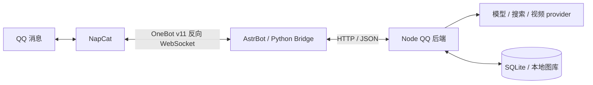

# 从零看懂 QQ 机器人：Node.js 基础与消息输出

> 这不是一份把名词罗列出来的速查表，而是面向第一次接触 Node.js 服务的解释文档。  
> 建议先读本文，再读[项目架构、设计与学习指南](node-service-architecture-and-learning-guide.md)。
> 按 2026-09-18 的 QQ 实现整理。文中的默认值用于理解代码，线上配置可能覆盖它们。

本文以 QQ 群里实际看到的结果为线索。仓库仍叫 `wecom-meme-bot`，也保留企业微信入口，但两种平台的入口、协议和发送方式不同，不能把企微的说明直接套到 QQ 上。

| QQ 里的输入 | 正常情况下看到什么 | 背后主要做了什么 |
| --- | --- | --- |
| 明确 `@机器人` 提问或私聊 | 文本回复，按回复路径搭配龙图 | Node 回复引擎读取记忆、调用模型，Bridge 发回 QQ |
| 群友普通聊天 | 可能静默，也可能独立接一句话 | 旁观记录与“是否值得接话”的判定 |
| 两个不同群友连续发送同一句纯文本 | 机器人在这一轮只复读一次 | 本地规则判断，不调用模型生成复读 |
| B 站、小红书、抖音视频分享 | 一张简介卡片，然后视频；卡片失败仍继续视频 | 平台解析、卡片绘制、下载/转发、QQ 发送 |
| 支持的图文分享 | 独立简介卡片，然后只含图片的合并聊天记录 | 首图或多图预览绘制成卡片，原图组成转发节点 |
| 超大视频或提取超时 | 尽量保留简介卡片，再提示前往平台观看 | 视频大小或提取时间限制 |

这些是业务结果，不是每条消息都必然触发的承诺。群权限、主动回复开关、节流、平台登录态和发送失败都会影响结果。第 18 节会沿具体消息走完整条链路，第 19 节提供不连接 QQ 的本地实验。

## 0. 先建立三个最重要的认识

### 0.1 JavaScript 和 Node.js 不是同一个东西

JavaScript 是一门编程语言。变量、函数、对象、数组、`if`、`for`、`Promise` 等都属于 JavaScript。

Node.js 是一个让 JavaScript 可以在浏览器之外运行的运行环境。它额外提供了很多服务端能力，例如：

- 读取文件：`node:fs`；
- 处理路径：`node:path`；
- 发起网络请求：`fetch`；
- 计算哈希：`node:crypto`；
- 启动子进程：`node:child_process`；
- 接收退出信号：`process.on(...)`。

浏览器里的 JavaScript 通常操作网页 DOM；这个项目里的 JavaScript 运行在 Node.js 中，主要操作网络连接、文件和进程状态。

### 0.2 “服务”不等于“一定开一个 HTTP 端口”

服务是一个长期运行、持续完成某类任务的程序。很多 Node.js 教程从 Express 开始，所以容易形成“Node 服务就是监听 3000 端口”的印象。

当前 QQ 后端确实启动了 HTTP 服务，使用 Node 自带的 `node:http`，没有使用 Express。QQ 的长连接由 NapCat 和 AstrBot 负责，Python Bridge 插件再通过 HTTP 请求 Node 后端：



NapCat 负责接收和发送 QQ 消息；AstrBot 是承载插件的机器人框架；Bridge 意为“桥”，把 QQ 消息和 Node 返回的数据互相转换；Node 后端负责业务判断。视频 provider 是提供平台解析能力的模块或服务，不是聊天模型。

另一个入口 `src/index.js` 才是直接连接企业微信的版本。理解“服务”的关键是持续处理任务，而不是是否采用某个框架。

### 0.3 源代码、进程和服务实例是三个层次

- 源代码：磁盘上的 `.js` 文件；
- 进程：执行 `npm run start:qq` 后，操作系统中正在运行的 Node 程序；
- 服务实例：对外提供能力的那一个运行中进程或容器。

每执行一次启动命令，通常会创建一个新的 Node.js 进程。两个进程有各自独立的内存，彼此的 `Map`、`Set` 和变量并不共享。AstrBot 的 Python 进程也不能直接读取 Node 的变量，因此双方需要通过 JSON 交换数据。

当前 QQ 的去重、排队和部分缓存属于进程内状态，不能靠多启动几个 Node 实例就得到可靠的扩容；端口和 SQLite 文件的使用方式也需要一起设计。日常更新应替换既有服务实例。

## 1. `node`、`npm` 和一个 Node.js 项目

### 1.1 `node` 命令是什么

`node` 是运行 JavaScript 文件的程序：

```bash
node src/qq-api.js
```

可以把它类比为“把 `src/qq-api.js` 交给 Node.js 执行”。这是正式服务入口，需要先配置；第一次学习先查看版本，不必立即启动服务：

```bash
node --version
```

本项目要求 Node.js **22.5 或更高**，尤其因为 QQ 记忆和图库使用内置的 `node:sqlite`。`fetch` 和 ESM 可用于更早版本，不能据此认为 Node 20 足够运行当前项目。

### 1.2 `npm` 是什么

npm 主要做两件事：

1. 管理第三方依赖；
2. 执行 `package.json` 里定义的脚本。

例如：

```bash
npm ci             # 按锁文件安装依赖
npm run start:qq   # 启动 QQ 的 Node HTTP 后端，需要 .env.qq
npm test           # 执行测试
```

`npm run start:qq` 不是 JavaScript 语法。npm 会打开 [`package.json`](../package.json)，找到对应脚本（以下仅摘录两项）：

```json
{
  "scripts": {
    "start": "node src/index.js",
    "start:qq": "node --disable-warning=ExperimentalWarning src/qq-api.js"
  }
}
```

然后替你执行右侧的 shell 命令。

`npm start` 启动的是企业微信，`npm run start:qq` 才是 QQ 后端；后者也不会替你启动 AstrBot、NapCat 或登录 QQ。`npm run dev:qq` 是监视文件变化并自动重启的开发命令。

### 1.3 `package.json` 是什么

它是 Node.js 项目的主要说明文件，常见字段包括：

- `name`：包或项目名称；
- `version`：当前版本；
- `private: true`：阻止误发布到 npm；
- `type: module`：本项目使用 ESM 模块；
- `scripts`：可执行命令；
- `dependencies`：生产运行需要的第三方包；
- `engines`：建议或要求的 Node.js 版本。

### 1.4 依赖、包和 `node_modules`

“包”是一组可以被其他项目复用的代码。这个项目直接依赖：

- `@wecom/aibot-node-sdk`：保留的企业微信入口使用，QQ 不通过它发消息；
- `dotenv`：读取配置文件，QQ 入口明确选择 `.env.qq`；
- `jimp`：处理图片。

`npm install` 会把依赖安装到 `node_modules/`。源码通过包名导入它们：

```js
import dotenv from 'dotenv';
```

`node_modules` 通常不提交 Git，因为它可以根据依赖清单重新安装。

`node:http`、`node:sqlite` 属于 Node 内置模块，不需要单独安装 npm 包。Bridge 和卡片绘制属于 Python 环境，不能用 `npm ci` 安装它们的依赖。

### 1.5 `package-lock.json` 是什么

`package.json` 里的 `^1.0.7` 表示允许安装某个兼容范围内的版本，不一定永远是完全相同的一份代码。

`package-lock.json` 记录实际解析出的精确版本和依赖树，让其他机器更容易安装出同样的结果。生产构建常用：

```bash
npm ci
```

它会严格依据 lockfile 安装，适合 CI 和 Docker。

## 2. 模块：为什么代码被拆成多个文件

### 2.1 模块是什么

模块就是一个有明确输入、输出和职责的代码文件。拆模块的目的包括：

- 避免所有逻辑挤在一个巨大文件里；
- 让不同部分可以单独测试；
- 明确哪些能力对外公开；
- 让多处代码复用同一个实现。

例如 [`src/triggers.js`](../src/triggers.js) 导出：

```js
export function isLongtuRequest(content) {
  // ...
}
```

另一个文件再导入：

```js
import { isLongtuRequest } from './triggers.js';
```

`export` 表示“这个名字允许其他模块使用”，`import` 表示“我要使用另一个模块导出的东西”。

### 2.2 三类导入来源

这个项目里可以看到三类导入：

```js
// Node.js 内置模块
import path from 'node:path';

// npm 安装的第三方包
import dotenv from 'dotenv';

// 项目自己的相对路径模块
import { RepeatDetector } from './repeat-detector.js';
```

`node:` 前缀明确表示这是 Node.js 自带模块，不需要 `npm install`。

### 2.3 ESM 是什么

ESM 是 ECMAScript Modules 的缩写，即 `import`/`export` 模块系统。本项目在 `package.json` 中设置了：

```json
{ "type": "module" }
```

因此 `.js` 文件按 ESM 处理。项目内的相对导入通常要写完整扩展名：

```js
import { QqMemoryStore } from './qq-memory-store.js';
```

另一种旧模块系统叫 CommonJS，使用 `require()` 和 `module.exports`。初学时不要在同一文件中随意混用两套语法。

### 2.4 默认导出和命名导出

```js
// 默认导入：名字可以由导入者决定
import path from 'node:path';

// 命名导入：名字必须和导出时一致
import { readFile } from 'node:fs/promises';
```

一个模块最多有一个默认导出，但可以有很多命名导出。

### 2.5 模块初始化和顶层 `await`

第一次导入模块时，模块顶层代码会执行。之后再导入同一模块，通常复用已经初始化的模块实例，而不是每次重跑一份。

ESM 允许在函数外直接写：

```js
const restoredCount = await conversationStore.load();
```

这叫顶层 `await`。导入这个模块的代码会等待它初始化完成。

### 2.6 为什么 ESM 中要处理 `import.meta.url`

ESM 没有 CommonJS 的全局 `__dirname`。`import.meta.url` 表示当前模块的 URL，项目把它转换为文件路径：

```js
const currentDirectory = path.dirname(fileURLToPath(import.meta.url));
```

这样无论你从哪个工作目录启动程序，都能根据源码文件自身的位置找到项目资源。

## 3. 阅读项目代码需要的 JavaScript 语法

### 3.1 `const` 和 `let`

```js
const botId = 'abc';
let shuttingDown = false;
```

- `const`：变量不能重新赋值；
- `let`：变量之后可以重新赋值；
- 不要使用旧式的 `var` 作为默认选择。

注意：`const` 只限制变量绑定，不会自动冻结对象：

```js
const options = {};
options.wsUrl = 'wss://example.com'; // 可以
// options = {};                    // 不可以
```

### 3.2 常见值和类型

项目中常见的 JavaScript 值：

```js
'text'           // string
6000             // number
true             // boolean
undefined        // 没有提供值
null             // 明确表示空
['a', 'b']       // array，本质上是特殊对象
{ enabled: true } // object
() => {}         // function
```

JavaScript 是动态类型语言：变量本身没有固定的编译期类型，因此读取外部数据时必须主动校验。

### 3.3 对象与属性

```js
const options = {
  botId: botId,
  secret: secret,
};
```

当属性名和变量名相同，可以简写：

```js
const options = { botId, secret };
```

访问属性：

```js
options.botId
options['botId']
```

点语法更常见；方括号适合属性名来自变量的场景。

### 3.4 解构

解构是从对象或数组中取出值：

```js
const { apiKey, model } = options;
const [rolePrompt, knowledge, aliases] = results;
```

它们分别近似于：

```js
const apiKey = options.apiKey;
const model = options.model;

const rolePrompt = results[0];
const knowledge = results[1];
```

### 3.5 展开语法 `...`

展开语法可以复制或拼接数组、对象：

```js
const nextMessages = [
  ...oldMessages,
  { role: 'user', content: '你好' },
];

const nextResult = {
  ...oldResult,
  fromCache: true,
};
```

这是浅拷贝：嵌套对象仍可能引用同一份数据。

在函数参数定义中，`...` 也可以表示“收集剩余参数”，要结合位置判断含义。

### 3.6 可选链 `?.`

外部消息可能缺少某一层字段。直接访问会报错：

```js
message.sender.user_id // sender 不存在时抛出错误
```

可选链会在中途遇到 `null` 或 `undefined` 时返回 `undefined`：

```js
message?.sender?.user_id
```

它只避免“访问空值属性”的异常，不代表数据一定合法。

### 3.7 空值合并 `??` 和逻辑或 `||`

```js
const timeout = options.timeoutMs ?? 6000;
```

只有左侧是 `null` 或 `undefined` 时，`??` 才使用右侧。

```js
const label = configuredLabel || '默认标签';
```

`||` 会在左侧为任意假值时使用右侧，包括：`false`、`0`、`''`、`null`、`undefined`、`NaN`。

区别很重要：

```js
0 ?? 10 // 0，配置明确为 0
0 || 10 // 10，因为 0 是假值
```

### 3.8 真值和假值

`if (value)` 会把值转换为布尔值。常见假值：

- `false`
- `0`
- 空字符串 `''`
- `null`
- `undefined`
- `NaN`

空数组 `[]` 和空对象 `{}` 都是真值。

### 3.9 三元表达式

```js
const label = enabled ? '已开启' : '已关闭';
```

它相当于一个有结果的简短 `if/else`。嵌套太深会降低可读性，应适时改回普通 `if`。

### 3.10 模板字符串

反引号字符串允许插入表达式：

```js
const message = `请求超时（${timeoutMs}ms）`;
```

`${...}` 中可以放 JavaScript 表达式。它和普通单引号字符串不同。

### 3.11 箭头函数与回调函数

```js
const double = (number) => number * 2;

client.on('connected', () => {
  console.log('已连接');
});
```

函数可以像普通值一样传给另一个函数。被传进去、等待以后调用的函数通常叫回调函数。

箭头函数没有自己的 `this`，类方法中是否适合使用它要看具体上下文。

### 3.12 常见数组方法

这个项目经常使用：

```js
items.filter((item) => item.enabled) // 保留满足条件的项
items.map((item) => item.name)       // 把每项转换成新值
items.some((item) => item.isImage)   // 是否至少有一项满足
items.find((item) => item.id === id) // 找第一项
items.reduce((sum, item) => sum + item.size, 0) // 汇总
items.slice(-10)                     // 复制最后 10 项
items.flat()                         // 展平一层嵌套数组
```

`map`、`filter`、`slice` 会返回新数组；`push`、`splice` 会修改原数组。读代码时要分清是否产生副作用。

### 3.13 类、实例、构造函数和 `this`

类是创建一类对象的模板：

```js
class Counter {
  constructor(start = 0) {
    this.value = start;
  }

  increment() {
    this.value += 1;
  }
}

const counter = new Counter(10);
counter.increment();
```

- `Counter`：类；
- `counter`：类创建出的实例；
- `new`：创建实例并调用构造函数；
- `constructor`：初始化实例；
- `this`：当前实例；
- `increment`：实例方法。

本项目的 `new QqMemoryStore(...)`、`new LongtuLibrary(...)` 和 `new OpenAICompatibleChatClient(...)` 都是这个模式。

### 3.14 getter

```js
get isConfigured() {
  return Boolean(this.apiKey && this.baseUrl && this.model);
}
```

调用时看起来像读取属性：

```js
chatClient.isConfigured
```

而不是：

```js
chatClient.isConfigured()
```

getter 适合表示由当前对象状态计算出的属性。

## 4. 同步、异步、Promise 与 `async/await`

这是理解 Node.js 服务最关键的一组概念。

### 4.1 同步是什么意思

同步代码在当前操作完成前，不会执行下一行：

```js
const upper = 'hello'.toUpperCase();
console.log(upper);
```

字符串计算很快，同步执行很合理。但读取磁盘、等待网络可能需要几毫秒到几分钟，如果整个进程一直原地等，会浪费处理其他工作的机会。

### 4.2 异步是什么意思

异步操作先启动一个未来才完成的工作，然后把完成结果交给回调或 Promise。

例如：

```js
const promise = readFile('config/system-prompt.md', 'utf8');
```

此时得到的不是文件内容，而是一个 Promise。Promise 表示“未来可能成功，也可能失败的结果”。

### 4.3 Promise 的三种状态

一个 Promise 有三种状态：

- pending：进行中；
- fulfilled：成功完成；
- rejected：失败。

状态从 pending 变成 fulfilled 或 rejected 后就不会再改变。

```js
readFile('a.txt', 'utf8')
  .then((content) => console.log(content))
  .catch((error) => console.error(error));
```

`.then` 处理成功结果，`.catch` 处理失败。

### 4.4 `async` 函数

在函数前加 `async` 后，该函数一定返回 Promise：

```js
async function getNumber() {
  return 42;
}

const result = getNumber(); // Promise，不是数字 42
```

即使 `return 42`，调用者得到的也是一个最终 fulfilled 为 42 的 Promise。

### 4.5 `await` 做了什么

`await` 等待 Promise 完成，并取出成功结果：

```js
const content = await readFile('a.txt', 'utf8');
```

如果 Promise rejected，`await` 会像 `throw` 一样抛出错误。

最重要的理解是：

> `await` 暂停的是当前 `async` 函数，不是把整个 Node.js 进程冻结。

在等待模型网络响应时，事件循环仍可以接收另一个群的消息。

### 4.6 顺序等待与并发等待

顺序执行：

```js
const a = await readFile('a.txt', 'utf8');
const b = await readFile('b.txt', 'utf8');
```

第二次读取要等第一次完成后才启动。

并发启动、一起等待：

```js
const [a, b] = await Promise.all([
  readFile('a.txt', 'utf8'),
  readFile('b.txt', 'utf8'),
]);
```

两项互不依赖时，`Promise.all` 通常更快。任意一项失败，整个 `Promise.all` 会 rejected。

并发不一定等于多线程。这里主要是两个 I/O 同时处于等待中。

### 4.7 为什么不能漏掉 `await` 或 `.catch`

```js
service.handleMessage(payload); // 如果内部失败且无人等待，可能形成未处理拒绝
```

QQ HTTP 入口在 `try/catch` 中等待业务函数。下面是简化示意：

```js
try {
  const result = await service.handleMessage(payload);
  sendJson(response, 200, { ok: true, ...result });
} catch (error) {
  console.error('处理消息失败：', error.message);
  sendJson(response, 500, { ok: false, error: 'QQ Bot 服务暂时不可用' });
}
```

如果漏掉 `await`，`try/catch` 可能已经执行完，异步错误才发生。对于确实要放在后台运行的任务，也应显式挂 `.catch(...)` 并记录失败。

### 4.8 `try`、`catch` 和 `finally`

```js
try {
  const response = await fetch(url);
  return await response.json();
} catch (error) {
  console.error(error);
  throw error;
} finally {
  clearTimeout(timeout);
}
```

- `try`：可能失败的代码；
- `catch`：发生错误时执行；
- `finally`：无论成功或失败都执行，适合释放资源。

`catch` 后如果不重新 `throw`，错误就被当前层消费掉了。是否继续抛出取决于这一层能否真正恢复。

## 5. 事件循环：Node.js 为什么能同时等很多事情

### 5.1 一个简化模型

可以把 Node.js 主线程想成一个不断取任务的工作人员：

```text
取一个可执行回调
  -> 执行到结束或遇到 await
  -> 取下一个回调
  -> 网络/文件完成后，把对应后续任务放回队列
  -> 继续循环
```

这个调度机制就是事件循环的一部分。

### 5.2 Node.js 不是“每个请求一个 JavaScript 线程”

多数 JavaScript 代码运行在一个主线程上。Node.js 底层会借助操作系统和线程池完成某些 I/O，但回调最终仍由事件循环调度到 JavaScript 主线程执行。

所以会出现两个看似矛盾、实际上同时成立的事实：

- Node.js 很擅长同时等待大量网络 I/O；
- 一个很慢的同步 CPU 循环会卡住所有消息处理。

### 5.3 I/O 密集和 CPU 密集

I/O 密集：大部分时间在等待外部系统。

- 等 Bridge 的 HTTP 请求、平台视频数据或 QQ 发送回执；
- 等大模型响应；
- 等文件读取。

CPU 密集：大部分时间在本机做计算。

- 大量图片特征计算；
- 压缩大图片；
- 超大循环或复杂计算。

本项目有离线图库索引脚本，也有运行时 OCR、视频处理和 Python 卡片绘制。它们常交给子进程或其他服务执行，但仍会消耗同一台机器的 CPU、内存和磁盘；写了 `async` 并不会消除这部分成本。

### 5.4 定时器和 `unref()`

```js
setTimeout(() => {
  processedMessageIds.delete(messageId);
}, 10 * 60 * 1000).unref();
```

`setTimeout` 表示至少等待指定时间后，把回调加入可执行队列，不保证精确到那一毫秒。

普通活动定时器会让 Node.js 进程继续存活。`.unref()` 表示“如果只剩这个定时器，就不必为了它阻止进程退出”。

## 6. 事件驱动、回调和 WebSocket

### 6.1 什么是事件

事件表示“某件事发生了”，例如：

- WebSocket 已连接；
- 认证成功；
- 收到文本消息；
- 连接断开；
- 出现错误。

### 6.2 什么是监听器

监听器是事件发生时要执行的回调：

```js
client.on('connected', () => {
  console.log('连接成功');
});
```

- `'connected'`：事件名；
- `() => { ... }`：监听器函数；
- `.on`：每次事件发生都执行；
- `.once`：最多执行一次。

### 6.3 HTTP 和 WebSocket 的区别

HTTP 常见模型：

```text
客户端发请求 -> 服务端回响应 -> 本次交互结束
```

WebSocket 常见模型：

```text
先建立一条长期连接
连接两端都可以在以后主动发送消息
直到断开
```

QQ 链路中的 WebSocket 位于 NapCat 与 AstrBot 之间。所谓“反向 WebSocket”，是 NapCat 主动连接 AstrBot 提供的地址。Bridge 到 Node 则是一次次 HTTP 请求；Node 后端本身不负责登录 QQ。

### 6.4 长连接、心跳和重连

- 长连接：连接建立后保持，不为每条消息重新连接；
- 心跳：定期发送小消息确认连接仍然有效；
- 重连：网络断开后重新建立连接；
- 认证：证明这个连接属于配置的机器人。

连接参数要在 NapCat/AstrBot 中检查。Node 的 `/healthz` 正常，只能说明后端可访问，不能证明 OneBot 已连接或 QQ 登录有效。

### 6.5 SDK 和 API 有什么区别

API 是系统暴露给其他程序使用的接口规范，例如“上传图片需要什么参数”。

SDK 是某种语言中的工具包，它把 API 或协议封装成更容易调用的方法。例如 OneBot 定义了发送群消息的 action，Python 客户端封装了调用方式（示意，不是在 Node 里运行）：

```python
result = await client.call_action('send_group_msg', group_id=group_id, message=segments)
```

你可以不用 SDK 而直接实现底层协议，但通常更复杂，也更容易出错。

## 7. HTTP、JSON、`fetch` 和大模型接口

### 7.1 请求和响应

一次 HTTP 调用通常包含：

```text
请求：URL + 方法 + Header + Body
响应：状态码 + Header + Body
```

项目调用大模型时：

- URL：`${baseUrl}/chat/completions`；
- 方法：`POST`；
- Header：认证和内容类型；
- Body：模型、消息、温度、token 上限等 JSON。

### 7.2 常见 HTTP 方法

- `GET`：读取资源；
- `POST`：提交数据或触发处理；
- `PUT/PATCH`：更新资源；
- `DELETE`：删除资源。

方法表达意图，但实际行为仍由服务端实现决定。

### 7.3 Header 是什么

Header 是请求或响应的元信息：

```js
headers: {
  Authorization: `Bearer ${apiKey}`,
  'Content-Type': 'application/json',
}
```

- `Authorization`：携带访问凭证；
- `Content-Type`：告诉服务端 Body 是 JSON。

Secret 和 API Key 不应写入源码、提交 Git 或打印到日志。

### 7.4 JSON 是什么

JSON 是一种跨语言传输文本数据的格式：

```json
{
  "model": "deepseek-chat",
  "stream": false
}
```

JavaScript 对象和 JSON 字符串不是同一种东西：

```js
const jsonText = JSON.stringify(jsObject); // 对象 -> JSON 字符串
const jsObject = JSON.parse(jsonText);      // JSON 字符串 -> 对象
```

JSON 不支持函数、`undefined`、注释和循环引用。

### 7.5 状态码和 `response.ok`

常见状态码分类：

- 2xx：成功；
- 4xx：请求、权限、配额等客户端侧问题；
- 5xx：上游服务端问题。

`fetch` 遇到 HTTP 500 时通常不会自动 throw，所以项目显式检查：

```js
if (!response.ok) {
  throw new Error(`HTTP ${response.status}`);
}
```

网络连接失败和 HTTP 500 是不同层次：前者可能连响应都没收到，后者是收到了错误响应。

### 7.6 `fetch`

当前要求的 Node.js 22.5+ 中可以直接：

```js
const response = await fetch(url, options);
const body = await response.json();
```

读取 Body 的方法只能按实际格式选择，例如 `.json()`、`.text()`。错误页面未必是 JSON，因此项目解析错误详情时又套了一层 `try/catch`。

### 7.7 超时和 `AbortController`

`fetch` 没有业务上合适的默认超时。上游一直不返回时，消息处理就可能一直挂着。

项目做法：

```js
const controller = new AbortController();
const timeout = setTimeout(() => controller.abort(), timeoutMs);

await fetch(url, { signal: controller.signal });
```

超时后 `abort()` 取消请求，`fetch` 抛出名为 `AbortError` 的错误。`finally` 中再清除定时器，避免无用定时器继续存在。

### 7.8 “OpenAI 兼容”是什么意思

它不等于一定在调用 OpenAI。它表示供应商实现了与 OpenAI Chat Completions 相近的 URL、请求字段和响应结构，因此同一个客户端只需更换：

- `baseUrl`；
- `apiKey`；
- `model`。

就可能连接不同供应商。兼容接口仍可能在 `thinking` 等扩展字段上存在差异。

### 7.9 两种“流式”不要混淆

`chat-client.js` 给模型发送的是：

```js
stream: false
```

说明模型响应不是 token 流式返回，而是等待完整正文。

视频代理的“流式”则是不断把视频字节从平台传给 NapCat，不必把整个文件塞进一个 JSON 或一个巨大 `Buffer`。这里传输的是文件，不是模型文字。

QQ 当前不是一边收到模型 token 一边更新聊天气泡。卡片先出现，也不代表视频上传已经完成。

## 8. 状态、内存、`Map`、`Set` 和缓存

### 8.1 什么是状态

状态是程序为了以后使用而记住的数据。例如：

- 哪些消息 ID 已经处理；
- 某个会话以前说过什么；
- 某个分享链接最近解析出的可播放地址；
- 某个搜索词最近的结果。

只根据本次输入立即计算、之后完全不记忆的程序叫无状态。这个机器人显然是有状态的。

### 8.2 进程内存

普通变量、对象、数组、`Map` 和 `Set` 默认只存在当前进程内存中：

- 读取快；
- 进程退出后丢失；
- 其他进程看不到；
- 过多数据会占用内存。

因此需要决定哪些状态可以丢，哪些状态必须落盘。

### 8.3 `Set`

`Set` 保存不重复的值，适合快速判断“是否见过”：

```js
const ids = new Set();
ids.add('msg-1');
ids.has('msg-1');    // true
ids.delete('msg-1');
```

项目用它做消息 ID 去重和图片哈希去重。

### 8.4 `Map`

`Map` 保存键和值的对应关系：

```js
const conversations = new Map();
conversations.set('group:123', messages);
conversations.get('group:123');
conversations.delete('group:123');
```

对象也能保存键值，但 `Map` 更适合运行时动态集合，并提供 `.size`、迭代和任意类型键。

### 8.5 缓存

缓存保存一份可以重新计算或重新获取的数据副本，用空间换时间或网络费用。例如：

```text
群 A 分享一个链接 -> 解析出标题、作者、封面、视频地址 -> 保存解析结果
群 B 再分享同一内容 -> 有效期内尽量复用解析结果 -> 仍需要发送到群 B
```

缓存不等于可靠存储。缓存丢失后，程序应能回源或重新计算。

这里至少有四种容易混淆的“缓存”：

| 名称 | 保存什么、解决什么问题 | 不代表什么 |
| --- | --- | --- |
| 模型输入缓存 | 模型供应商复用相同请求前缀的计算，命中量写入 token 日报 | 不是把旧回答原样再发一次 |
| 媒体解析缓存 | 复用分享元数据和媒体地址，默认 TTL 600 秒，也能跨群复用 | 不代表 QQ 已有这份视频，不免除发送 |
| 卡片相关缓存 | Bridge 复用封面图片等数据，减少重复取图 | 卡片缺头像不应该使可用视频失效 |
| 临时视频文件 | Node 或 NapCat 下载、发送时落盘的文件 | 不是聊天记忆，也不是模型缓存 |

SQLite 中的会话和成员画像是持久化业务数据，不能作为这些缓存一起清空。模型缓存命中率低，应检查稳定提示前缀和请求构造，而不是删除视频目录。

### 8.6 TTL

TTL 是 Time To Live，表示数据可以存活多久：

```js
{
  value: result,
  expiresAt: Date.now() + 30 * 60 * 1000,
}
```

读取时要比较当前时间：

```js
if (entry.expiresAt > Date.now()) {
  return entry.value;
}
```

只设置 `expiresAt` 不会自动删除数据；程序仍要在读取、定时任务或其他时机清理。

### 8.7 幂等和消息去重

幂等表示同一个操作执行多次，最终效果和执行一次相同。

网络系统可能重复投递消息。QQ 后端用“消息类型 + 群号或私聊 QQ 号 + `message_id`”组成去重键，默认保留十分钟。它是“尽力而为”的进程内去重：重启后记录丢失，过期后也会再次允许处理。抛出异常的处理会移除对应键，正常返回一个失败业务结果则不一定移除。

严格幂等通常需要持久化消息 ID，并明确保存多久。

“同一事件重复投递”和“群友重复说同一句话”是两回事：后一种有不同的消息 ID，由 `RepeatDetector` 管。两个不同真人连续说相同纯文本后，机器人只复读一次；第三个人再跟同一句也不会再触发。这一轮没有 30 秒之类的到期时间，直到其他内容打断；状态只在内存中，重启会丢失。

## 9. 并发、并行、竞态和 Promise 队列

### 9.1 并发和并行

- 并发：多个任务在同一时间段内都在推进；
- 并行：多个任务在同一时刻真的同时执行。

Node.js 可以并发等待很多网络请求，即使 JavaScript 主线程同一时刻通常只执行一个回调。

### 9.2 为什么单线程也会有顺序问题

看这个例子：

```js
async function reply(message) {
  const history = getHistory();
  const answer = await callModel(history, message);
  saveHistory(message, answer);
}
```

A 调用模型后进入等待，事件循环可以开始处理 B。B 也可能读取到还没有 A 的历史。如果 B 的模型先返回，顺序就会颠倒。

这不是两个 JavaScript 语句同时修改内存，而是异步任务交错造成的逻辑竞态。

### 9.3 Promise 队列如何解决

项目为每个 `conversationId` 保存“上一个任务的 Promise”：

```js
const previous = queues.get(conversationId) ?? Promise.resolve();
const current = previous.catch(() => {}).then(task);
queues.set(conversationId, current);
```

含义是：

1. 找到该会话上一个任务；
2. 不论上个任务成功或失败，都在它结束后执行当前任务；
3. 把当前任务记录为新的队尾；
4. 完成后，如果它仍是队尾，就删除队列记录。

结果：

```text
群 A：消息 1 -> 消息 2 -> 消息 3
群 B：消息 1 -> 消息 2

群 A 内部有顺序，群 B 内部有顺序；A 与 B 仍可并发。
```

当前代码有群级的 `QqBotService.runGroupExclusive` 和记忆层的 `QqMemoryStore.runExclusive`。前者覆盖该群 Node 处理阶段，包括媒体解析，所以慢解析可能使同群下一条请求排队。

但 Node 返回视频地址后，Bridge/NapCat 的发送不属于这条 Node 队列。不同分享的传输可能交错；当前保证的是一次分享先尝试发卡片再发它的视频，不能据此推导整个群所有视频严格按分享顺序送达。媒体解析默认最多并发两项，也不等于所有下载和 QQ 上传加起来最多两项。

### 9.4 为什么有 `.catch(() => {})`

如果上一个 Promise rejected，直接 `.then(task)` 默认不会执行 `task`。先 `.catch(() => {})` 把上一项失败转换成完成状态，保证一条消息失败不会永久堵死后续队列。

这不是忽略所有错误：上一个任务自己的调用者仍会接到它的错误；这里处理的是“后续任务能否继续排队”。

## 10. 文件系统、路径和持久化

### 10.1 当前工作目录和源码目录

当前工作目录 `process.cwd()` 是你从哪里启动命令。源码目录是当前 `.js` 文件实际位于哪里。二者可能不同。

如果代码只写：

```js
readFile('config/system-prompt.md');
```

它会相对当前工作目录查找。项目先算出 `projectRoot`，再构造绝对路径，启动位置变化时更稳定。

### 10.2 相对路径和绝对路径

- 相对路径：`config/system-prompt.md`；
- 绝对路径：从文件系统根开始的完整路径。

常用函数：

```js
path.join(projectRoot, 'data', 'file.json');
path.resolve(projectRoot, configuredPath);
path.dirname(filePath);
path.basename(filePath);
path.extname(filePath);
```

不要手工用 `'/'` 拼接跨平台路径，优先使用 `node:path`。

### 10.3 `node:fs/promises`

传统 `fs` API 有回调形式；`node:fs/promises` 返回 Promise，适合 `async/await`：

```js
import { readFile, writeFile } from 'node:fs/promises';

const text = await readFile(filePath, 'utf8');
await writeFile(filePath, text, 'utf8');
```

### 10.4 文本编码 `utf8`

文件本质上是字节。读取文本时指定 `'utf8'`，Node.js 会把字节解码成 JavaScript 字符串。

```js
await readFile('a.md', 'utf8'); // string
await readFile('a.jpg');        // Buffer
```

图片不是 UTF-8 文本，不能用 `'utf8'` 读取。

### 10.5 `Buffer`

`Buffer` 是 Node.js 处理二进制数据的类型。图片、压缩数据、网络包都可能使用它。

```js
const buffer = await readFile(imagePath);
buffer.length;                 // 字节数
buffer.subarray(0, 8);         // 取前 8 字节
buffer.toString('base64');     // 转 Base64 文本
```

项目读取图片头的魔数，而不是只相信扩展名。这能识别“文件叫 `.jpg`，内容却不是 JPG”的情况。

### 10.6 Base64

Base64 把二进制编码成只包含普通文本字符的字符串，便于放入 JSON 或文本协议。代价是体积通常比原二进制大约增加三分之一。

Base64 不是加密，任何人都可以解码。

### 10.7 哈希

哈希函数把任意长度内容变成固定长度摘要：

```js
const sha256 = createHash('sha256')
  .update(buffer)
  .digest('hex');
```

本项目中的用途：

- 判断两张内容相同的图片；
- 用 SHA-256 建白名单和文件名；
- 用 MD5 满足某些图片消息字段要求；
- 把用户 ID 转成较少暴露原值的短标识。

哈希不是加密，通常不可逆，但短哈希和低熵输入仍可能被猜测或碰撞。

### 10.8 持久化

持久化是把内存数据保存到进程退出后仍存在的介质。当前 QQ 会话使用 **SQLite**，默认文件是 `data/qq-memory.sqlite`，由 `QqMemoryStore` 管理。

```text
QQ 输入 -> 会话和成员记录 -> SQLite 表 -> 磁盘上的数据库文件
进程重启 -> 打开同一数据库 -> 查询历史、摘要和成员信息
```

SQLite 是嵌入式数据库，不必再启动一个 MySQL 服务。表可以理解为有列名和记录的数据集合；SQL 用来查询和更新；事务让一组相关修改一起成功或失败。

近期原文默认保留最多 30 天，还会按数量裁剪；成员画像独立保存，不跟随每一条原文一起过期。`data/longtu-library.sqlite` 保存图库信息，`data/qq-usage.sqlite` 保存模型/搜索用量，`data/qq-media-usage.sqlite` 保存媒体解析统计。旧 QQ JSON 记忆文件属于迁移来源，已经不是主存储。

### 10.9 为什么先写临时文件再 `rename`

如果直接写正式文件，程序在写到一半时崩溃，可能留下残缺 JSON。

这是旧会话文件及一般 JSON 文件常用的办法，仍值得理解，但不是当前 QQ SQLite 的写入流程：先完整写临时文件，再重命名替换。

```text
写 conversation-memory.json.<pid>.tmp
  -> 写完
  -> rename 为 conversation-memory.json
```

在同一文件系统中，rename 通常提供接近原子的替换效果：其他读取者看到的更可能是完整旧文件或完整新文件，而不是半个文件。

SQLite 使用自身的事务和日志机制。你可能在数据库旁看到 `-wal`、`-shm` 文件，其中可能有尚未合并回主文件的数据或协调信息；不能把它们当成没用的缓存随意删除。备份数据库也不能只在服务运行时随手复制其中一个文件。

## 11. 环境变量、配置和 `process`

### 11.1 环境变量是什么

环境变量是操作系统传给进程的字符串配置。它让凭证和环境差异不必硬编码在源码中。

Node.js 通过：

```js
process.env.QQ_API_TOKEN
```

读取环境变量。

### 11.2 `.env` 和 dotenv

QQ 本地开发把配置写进 `.env.qq`，字段从 [`.env.qq.example`](../.env.qq.example) 查阅。下面只是格式示意，令牌要自行生成：

```dotenv
QQ_API_HOST=127.0.0.1
QQ_API_PORT=8787
QQ_API_TOKEN=替换为至少32字符的随机令牌
```

`src/qq-api.js` 通过 dotenv 明确加载项目根目录的 `.env.qq`，也可用 `QQ_ENV_FILE` 指定文件。单独写 `import 'dotenv/config'` 通常读取的是 `.env`，两者不能混淆。QQ 启动时会拒绝过短或以“请替换”开头的示例令牌。

配置文件是 dotenv 的便利机制，不是 Node.js 自己自动寻找的文件。Compose 还会通过 `env_file` 注入环境变量。修改宿主机文件不会自动改变已运行进程的环境，通常需要按部署方式重建相应容器；本机 `.env.qq.example` 也不会修改云服务器的 `.env.qq`。

`QQ_API_TOKEN` 认证 Bridge 到 Node；`ONEBOT_TOKEN` 认证 NapCat 到 AstrBot；`LLM_API_KEY` 用于模型；平台 cookie/浏览器登录态用于视频 provider。它们不是同一个凭证。详细配置和启动步骤见 [QQ 部署文档](QQ_DEPLOYMENT.md)。

### 11.3 环境变量都是字符串

```dotenv
TIMEOUT=6000
ENABLED=false
```

读取后得到的是 `'6000'` 和 `'false'`。注意：

```js
Boolean('false') // true，因为非空字符串是真值
```

所以项目会显式解析数字，并用正则识别 `false/off/0`。

### 11.4 默认值和配置校验

外部配置不能直接信任：

```js
const parsed = Number.parseInt(raw, 10);
const limit = Number.isInteger(parsed) && parsed > 0
  ? parsed
  : DEFAULT_LIMIT;
```

这包含三步：解析、验证、回退默认值。

### 11.5 `process.exit()` 和退出码

```js
process.exit(0); // 正常结束
process.exit(1); // 失败结束
```

退出码 0 通常表示成功，非 0 表示失败。Shell、Docker 和 CI 可以据此判断命令是否成功。

立即调用 `process.exit()` 可能让尚未完成的异步日志或 I/O 来不及结束，因此退出前通常要先等待重要清理。

### 11.6 进程信号

- `SIGINT`：终端中按 Ctrl+C 常见；
- `SIGTERM`：Docker、Kubernetes 或系统服务常用的停止请求。

```js
process.once('SIGTERM', () => shutdown('SIGTERM'));
```

信号不是普通业务消息，而是操作系统对进程的控制通知。

### 11.7 `process.pid`

`process.pid` 是当前进程 ID。项目把它放进临时文件名，减少多个进程创建同名临时文件的概率。

## 12. 错误、异常和错误边界

### 12.1 `Error` 和 `throw`

```js
throw new Error('普通对话服务尚未配置');
```

`Error` 通常包含：

- `message`：可读错误信息；
- `name`：错误类型名；
- `stack`：调用栈，帮助定位发生位置。

`throw` 会中断当前正常控制流，寻找最近能处理它的 `catch`。

### 12.2 异步错误

在 `async` 函数里 `throw`，会让返回的 Promise rejected：

```js
async function work() {
  throw new Error('失败');
}

await work(); // 这里抛出
```

因此同步错误处理和 Promise 错误处理可以通过 `async/await + try/catch` 统一起来。

### 12.3 错误边界

错误边界是在某一层集中接住错误，决定：

- 重试；
- 降级；
- 记录日志；
- 向用户返回提示；
- 继续抛给更外层。

项目中有多层边界：

```text
Node 平台/模型请求：转换 HTTP、大小、超时错误
Node 业务层：决定降级，返回 mode 和 messages
Node HTTP 入口：异常转成状态码和 JSON
Python Bridge：解释结果，允许卡片失败后继续视频
OneBot 发送调用：检查真正的 message_id 回执，失败时反馈
```

不要在每层都无脑打印同一错误，否则日志会重复；也不要空 `catch` 所有错误，否则问题会被隐藏。

尤其要区分“函数返回成功”和“外部动作成功”。把视频交给框架后，框架可能在另一层捕获发送异常；上层没收到异常，并不能证明 QQ 已发出。当前普通分享的视频发送直接等待 OneBot 回执，拿到有效的 `message_id` 才标记成功。失败会尝试回应失败表情和提示；连提示本身也可能因 QQ 连接异常发送失败，需要保留日志。

### 12.4 Node.js 文件错误码

文件错误常带 `error.code`：

- `ENOENT`：文件或目录不存在；
- `EACCES`：没有权限。

不存在的可选文件可以回退默认值；凭证文件无法读取可能就应停止。是否忽略错误取决于业务语义。

## 13. 正则表达式和输入规范化

### 13.1 正则是什么

正则表达式是描述字符串模式的工具：

```js
/龙图/i.test(content)
```

`i` 表示英文字母匹配时忽略大小写。常见符号：

- `^`：字符串开头；
- `$`：字符串结尾；
- `.`：任意字符；
- `*`：前一项重复 0 次或更多；
- `+`：重复 1 次或更多；
- `?`：可选；
- `|`：或者；
- `(?:...)`：不捕获分组；
- `\s`：空白字符；
- `\d`：数字。

### 13.2 为什么先规范化

用户可能输入：

```text
@机器人   发点龙图！！！
```

代码会先去 mention、空格、末尾标点和大小写差异，再做意图匹配。这样规则更集中，不必为每一种表面写法重复正则。

### 13.3 正则的局限

- 复杂规则难读；
- 容易误判自然语言；
- 用正则解析完整 HTML/XML 很脆弱；
- 新增规则可能影响旧规则。

因此正则逻辑必须有大量正例、反例和边界测试。

## 14. 依赖注入：为什么测试可以不请求真实网络

### 14.1 硬编码依赖的问题

如果客户端方法直接写死全局 `fetch`、真实时间和正式地址，测试时就只能真的请求外网：

- 慢；
- 不稳定；
- 可能收费；
- 很难稳定制造超时和 500 错误。

### 14.2 把依赖从外面传进来

项目构造函数允许：

```js
this.fetchImpl = options.fetchImpl ?? globalThis.fetch;
this.now = options.now ?? Date.now;
```

生产环境不传，使用真实实现；测试环境传假实现：

```js
const fakeFetch = async () => ({
  ok: true,
  json: async () => fakeResponse,
});
```

这种“模块需要什么，由外部提供什么”的方式叫依赖注入。

它不一定需要大型框架。构造参数就是最简单的依赖注入。

## 15. 测试基础

### 15.1 为什么写测试

测试不是证明程序永远没有 bug，而是把已知期望变成可以重复运行的检查：

- 修改规则后，旧行为是否还成立；
- 超时和错误是否会正确转换；
- 会话是否隔离；
- manifest 是否真的限制图片；
- 并发消息是否按顺序执行。

### 15.2 测试的基本结构

```js
import test from 'node:test';
import assert from 'node:assert/strict';

test('说明要验证的行为', () => {
  const actual = 1 + 1;
  assert.equal(actual, 2);
});
```

通常可以按 Arrange、Act、Assert 理解：

1. Arrange：准备输入和依赖；
2. Act：调用被测代码；
3. Assert：检查结果。

### 15.3 单元测试和集成测试

- 单元测试：只验证一个小函数或类，外部依赖通常是假的；
- 集成测试：让多个真实模块一起工作；
- 端到端测试：从用户入口一直走到真实或接近真实的系统出口。

本项目有 Node 的规则、服务和存储测试，也有 Python Bridge 的媒体发送测试。`npm test` 不是同时启动 NapCat、登录 QQ、往群里发视频的端到端验收。涉及 AstrBot 行为还需要其运行环境中的集成验证；涉及真实送达，要核对 QQ 消息回执及实际消息。

### 15.4 测试替身

测试中的假 `fetch`、假时钟、临时目录都属于测试替身或受控环境。它们让测试可重复：今天运行和明天运行不依赖真实外网状态。

### 15.5 测试名称就是行为文档

例如：

```text
同一会话的并发任务会按顺序执行
仓库 manifest 是强制白名单
思考模式只返回空正文时自动降级快速模式
```

先读测试名称，再看实现，是理解陌生项目很有效的方法。

## 16. Docker 基础

### 16.1 镜像和容器

- 镜像：包含运行环境和项目文件的只读模板；
- 容器：根据镜像启动的一个隔离进程环境。

同一个镜像可以启动多个容器。QQ 部署中 Node 后端、AstrBot、NapCat 分工运行；抖音 provider 等还可以有独立容器。一个容器显示 `running` 只说明进程没退出，不代表整条 QQ 链路已连通。

### 16.2 Dockerfile 每行在做什么

```dockerfile
FROM node:22-bookworm-slim
```

以预装 Node.js 22 的精简 Debian 镜像为基础。真实 Dockerfile 还安装 OCR、Python 和媒体处理工具，这里只解释几个基础指令。

```dockerfile
WORKDIR /app
```

后续命令的工作目录设为 `/app`。

```dockerfile
COPY package.json package-lock.json ./
RUN npm ci --omit=dev
```

先复制依赖清单并安装生产依赖。源码变化但依赖不变时，可以利用 Docker 层缓存。

```dockerfile
COPY . .
CMD ["npm", "start"]
```

复制项目，其后容器默认执行 `npm start`，也就是企业微信入口。QQ Compose 用 `command: ["npm", "run", "start:qq"]` 覆盖它，因此阅读 Dockerfile 时还要一起看 Compose。

### 16.3 容器不自动保存重要数据

容器被删除时，容器可写层里的数据可能一起消失。若会话记忆必须跨容器重建保留，需要挂载持久卷或使用外部存储。

图片目录以只读卷挂载，可以减少运行时意外修改素材的风险。

服务器 QQ Compose 把 `./data` 挂到 `/app/data`，使 SQLite、动态图库等跨容器重建保留。抖音 provider 的 `data/douyin-profile` 保存浏览器登录态，也不能当构建缓存删除。NapCat 的临时视频又在另一处目录；项目提供每天北京时间 9 点清理前一天临时视频的 systemd timer，安装方式见 [QQ 部署文档](QQ_DEPLOYMENT.md#napcat-临时视频每日清理)。

## 17. 把基础概念对应回项目节点

| 项目节点 | 先掌握哪些概念 | 再观察什么 |
| --- | --- | --- |
| [`package.json`](../package.json) | npm、依赖、脚本、ESM | `start:qq` 如何选择入口 |
| [`src/qq-api.js`](../src/qq-api.js) | HTTP、配置、实例、进程信号 | 如何组装依赖、认证请求并返回 JSON |
| [`src/qq-service.js`](../src/qq-service.js) | 对象、分支、Promise 队列 | QQ 消息如何变成不同 mode 和 messages |
| [`src/repeat-detector.js`](../src/repeat-detector.js) | Map、Set、文本规范化 | 一轮复读为什么只处理一次 |
| [`src/active-reply.js`](../src/active-reply.js) | 条件判断、限流、时间 | 是否参与群聊和怎么回答为何分开 |
| [`src/qq-memory-store.js`](../src/qq-memory-store.js) | SQLite、队列、生命周期 | 原文、摘要、成员画像如何保存 |
| [`src/reply-engine.js`](../src/reply-engine.js) | async/await、策略、降级 | 如何组织检索、模型调用与人格质检 |
| [`src/chat-client.js`](../src/chat-client.js) | fetch、JSON、AbortController | 如何构造提示前缀、读取正文和用量 |
| [`src/longtu-library.js`](../src/longtu-library.js) | Buffer、哈希、SQLite | 图库与关键词、抽图进度如何保存 |
| [`src/media-resolver.js`](../src/media-resolver.js) | 缓存、并发限制、子进程 | 链接如何变成媒体元数据和可发送地址 |
| [`astrbot_plugin_longtu_bridge/main.py`](../astrbot_plugin_longtu_bridge/main.py) | Python 异步、协议转换、错误边界 | Node 返回后怎么生成卡片、发送视频、验证回执 |
| [`astrbot_plugin_longtu_bridge/video_card.py`](../astrbot_plugin_longtu_bridge/video_card.py) | 图像尺寸、字体、布局 | 作者头像、简介和多图预览怎样画出来 |
| [`test/`](../test/) | 断言、假依赖、临时文件 | 不连接真实服务时能验证什么 |
| [`docker-compose.server.yml`](../docker-compose.server.yml) | 容器、网络、挂载 | 已有 AstrBot 环境如何接入 QQ 后端 |

## 18. 用 QQ 中的输出把概念串起来

### 18.1 明确 @ 后的一条普通回答

假设群友发“@机器人 龙图是什么”：

1. NapCat 收到 QQ 消息，通过 OneBot 把消息段交给 AstrBot。
2. Bridge 提取文本、群号、QQ 号、消息 ID、艾特和引用，向 Node 发 `POST /v1/qq/message`。
3. Node 检查令牌，解析 JSON，规范化字段，进行去重和群权限判断。
4. 该群的处理进入 Promise 队列；明确点名进入相应回复路由。
5. 记忆模块提供近期上下文、摘要和相关成员信息。
6. 现有回复引擎按问题组织本地知识、检索和模型请求，继续使用既有角色设定。
7. 等待外部网络时，事件循环仍能处理其他可运行任务。
8. Node 记录本轮记忆和用量，返回包含文本及可能附图的结构化结果。
9. Bridge 把结果转换成 OneBot 消息；被动群聊回复带引用/艾特，主动插话则独立发送。

用户看到的是 QQ 消息，Node 返回的是 JSON。两者之间还有一个真正的发送动作。普通群聊也可能只返回空 `messages`：它可以表示记录了旁观、判定不接话、被去重或被配置排除，并不自动等于服务坏了。

### 18.2 视频分享：卡片出来以后还在等什么

一次成功分享大致经过：

```text
识别分享平台 → 解析作者、封面、标题与媒体地址 → 检查视频大小
    → Node 返回媒体结果 → Bridge 尝试发独立卡片
    → NapCat 获取视频并上传 QQ → 返回视频 message_id → 回应成功表情
```

卡片显示的是**视频作者**的圆形头像和昵称，不是转发这条链接的 QQ 用户。平台 logo 来自项目中的原生平台素材；B 站还显示发布时间；标题、正文和标签都属于卡片内容，不再另外补发一条标题消息。卡片失败不应挡住视频，卡片等待目前有 12 秒上限。

不同平台的获取路线并不完全相同：

| 平台 | 常用路线 | 初学者要注意什么 |
| --- | --- | --- |
| B 站 | 原生播放接口选取 MP4，常用 720P，经 Node 媒体代理交给 NapCat | 有备用 CDN；接口返回快不代表视频字节传输快 |
| 小红书 | provider 返回媒体信息，探测大小后通常把直链交给 NapCat | provider 登录态和临时直链有效期都会影响结果 |
| 抖音 | provider 使用持久化 Chromium 登录态解析，经 Node 代理交给 NapCat | 浏览器登录态和视频缓存不是一回事 |

配置、格式和上游失败可能让请求进入公开页面解析或 `yt-dlp` 回退。Node 代理还能后台预下载：文件已就绪就读取本地文件，否则流式代理。这些都不代表“解析接口返回时已经下载完”。

**大小和时间是不同限制：**

- 单视频上限为 `500 × 1024 × 1024` 字节，即 500 MiB，群内提示写作 500MB。已知源文件大小时先判断，超过就不开始完整下载。
- 源站没有可靠大小字段时，不能只凭时长推算；代码会尝试探测，支持的本地下载路径还会检查累计字节。直接交给 NapCat 的地址不经过 Node 全程计数，不能把这项兜底理解为所有路线完全相同。
- 提取阶段上限为 480 秒，从媒体解析取得并发名额后计时。配置的较短下载/provider 超时也可能先触发；同群排队和之后的 QQ 上传不是都包含在这一段计时里。
- 视频自身播放时长没有限制。一小时的视频也可能很小，四分钟的高码率视频也可能很大。
- Bridge 发送视频另有 480 秒的回执等待。只有拿到有效 `message_id` 才回应成功表情；没有回执会尝试发送失败/超时提示。超时只说明还没等到确认，QQ 端可能仍在上传，不能承诺已取消，也不会盲目重发造成重复。

所以不能用“卡片 2 秒出来、视频 5 分钟出来”推断解析用了 5 分钟。要分开看解析日志、媒体下载/代理日志，以及 Bridge 的“视频发送开始/成功/未成功”日志。媒体日报记录的是解析阶段，不能独自证明 QQ 视频送达。

### 18.3 图文分享：卡片和聊天记录为什么分开

支持的图文分享走 `media-gallery` 路由，绕过**视频**的 500 MiB 判断。卡片用首图或多图预览作封面区域，把作者、标题、正文和标签放在一张图中；多图最多展示九张预览，超过用 `+N` 表示未展示数量。

卡片作为独立图片先发。后面的合并聊天记录只放图片节点，不重复标题正文，也不把卡片再塞进去。转发失败会重试，并可降级为逐张图片。平台解析返回的图片数量仍有自身上限，不等于任意长度相册都会完整返回。

### 18.4 同一句为什么不会一直复读

```text
甲：好好好          → 记录这一轮，还不复读
乙：好好好          → 达到两个不同真人，机器人复读一次
丙：好好好          → 同一轮已处理，不再复读
丁：换个话题        → 打断原有这一轮
甲、乙再次连续重复  → 新一轮可再次触发
```

同一人刷多遍不算两个真人。文本会先统一全半角和空白；图片、引用、艾特、命令等不作为普通复读票数。这个小功能能同时说明规范化、Set 去重、Map 保存群状态，以及“规则判断不需要模型”。

## 19. 可以亲手运行的最小实验

在项目根目录使用 Node.js 22.5+ 运行。19.1～19.4 只用内置能力；其余实验先执行 `npm ci`。它们都不登录 QQ，不发送群消息，也不调用大模型。

### 19.1 Promise 和 `await`

```bash
node --input-type=module -e '
const wait = (ms) => new Promise((resolve) => setTimeout(resolve, ms));
console.log("A");
await wait(100);
console.log("B");
'
```

观察：A 先输出，约 100ms 后输出 B。

### 19.2 并发等待

```bash
node --input-type=module -e '
const wait = (name, ms) => new Promise((resolve) => {
  setTimeout(() => resolve(name), ms);
});
const startedAt = Date.now();
const result = await Promise.all([wait("A", 100), wait("B", 150)]);
console.log(result, Date.now() - startedAt);
'
```

总时间接近 150ms，而不是 250ms，因为两个定时器一起开始等待。

### 19.3 `Map` 和 TTL

```bash
node --input-type=module -e '
const cache = new Map();
cache.set("answer", { value: 42, expiresAt: Date.now() + 1000 });
const entry = cache.get("answer");
console.log(entry.expiresAt > Date.now() ? entry.value : "expired");
'
```

### 19.4 `Buffer` 和图片签名

```bash
node --input-type=module -e '
const signature = Buffer.from("89504e470d0a1a0a", "hex");
console.log(signature);
console.log(signature.toString("hex"));
'
```

### 19.5 只运行一个测试文件

```bash
node --test test/repeat-detector.test.js
```

然后打开测试和源码，逐条对照输入、调用和断言。

### 19.6 用真实复读模块观察一轮状态

```bash
node --input-type=module <<'JS'
import { RepeatDetector } from './src/repeat-detector.js';
const detector = new RepeatDetector({ logger: { log() {} } });
for (const userId of ['alice', 'bob', 'carol']) {
  const result = detector.detect({
    messageType: 'group', groupId: 'demo', userId, text: '好好好',
  });
  console.log(userId, result?.text ?? '静默');
}
JS
```

预期依次输出 `alice 静默`、`bob 好好好`、`carol 静默`。试着把三个 userId 都改成 `alice`，会全部静默；再给第三次输入换一句话，观察新一轮状态如何开始。

### 19.7 跑一次本机 HTTP 请求，不连接真实 QQ

这里使用真实 HTTP 接口工厂，但注入假的业务服务。端口 `0` 表示让系统分配空闲端口；`127.0.0.1` 只监听本机。示例令牌只用于这次实验，不能用作部署凭证。

```bash
node --disable-warning=ExperimentalWarning --input-type=module <<'JS'
import { createQqApiServer } from './src/qq-api.js';
const token = 'local-demo-token-not-for-production';
const service = {
  async handleMessage(payload) {
    return {
      mode: 'demo',
      messages: [{ type: 'text', text: `收到：${payload.text}` }],
    };
  },
};
const server = createQqApiServer({ service, apiToken: token });
await new Promise((resolve, reject) => {
  server.once('error', reject);
  server.listen(0, '127.0.0.1', resolve);
});
try {
  const response = await fetch(`http://127.0.0.1:${server.address().port}/v1/qq/message`, {
    method: 'POST',
    headers: { Authorization: `Bearer ${token}`, 'Content-Type': 'application/json' },
    body: JSON.stringify({ message_type: 'group', group_id: 'demo', text: '你好' }),
  });
  console.log(response.status, await response.json());
} finally {
  await new Promise((resolve, reject) => server.close((error) => error ? reject(error) : resolve()));
}
JS
```

预期 HTTP 状态为 `200`，JSON 含 `ok: true`、`mode: 'demo'` 和“收到：你好”。脚本随后关闭服务。它没有创建真实记忆库或模型客户端，也没有调用 Bridge；因此终端有结果而 QQ 没消息正是预期行为。

把请求头里的令牌改错，会返回 `401`。这能帮你区分“接口认证失败”和“QQ 登录失败”：两者发生在不同服务之间。

## 20. 初学者常见误区

### “用了 `async` 就自动变快”

不是。`async` 只是让函数返回 Promise。只有把可以同时等待的独立 I/O 合理并发，才可能缩短总时间。

### “`await` 会卡住整个 Node.js”

通常不会。它暂停当前异步函数。真正会卡住整个主线程的是长时间同步 CPU 代码。

### “单线程就没有并发问题”

不是。异步任务可能交错，导致读到旧状态或产生顺序错误。

### “`fetch` 收到 500 会自动进入 `catch`”

通常不会。要自己检查 `response.ok`。

### “环境变量中的 `false` 是布尔值 false”

不是，它是字符串 `'false'`，而且作为非空字符串是真值。

### “有文件扩展名就能确认文件类型”

不能。扩展名可以写错或伪造，应结合内容签名、大小和业务白名单。

### “Base64 和哈希都能保护秘密”

Base64 可以直接解码；哈希也不是加密。敏感凭证必须使用合适的秘密管理和访问控制。

### “缓存就是数据库”

不是。进程内缓存重启后会丢失，通常只保存可重新获取的数据。

### “测试通过就说明线上一定没问题”

测试只覆盖写下来的情况。真实网络、权限、限流、SDK 版本和平台行为仍需要集成验证与监控。

### “看到一个配置项就说明它生效”

不一定。要从 `process.env` 的读取位置和调用链确认。这个仓库就存在示例配置与当前实现漂移的情况。

### “Node 返回 ok 或卡片发出来了，视频就算成功”

不是。Node 返回表示业务处理完成到某个阶段；卡片和视频有独立发送过程。视频成功要等 OneBot 的有效消息回执。

### “八分钟限制就是不发超过八分钟的视频”

不是。限制的是提取耗时，另有发送回执等待；视频自身的播放时长不作为拒绝条件。`duration`、文件字节数和请求耗时是三个量。

### “缓存命中以后就不用上传 QQ”

解析缓存可以省掉重复解析，但新群仍要收到自己的消息，视频下载/上传可能仍需执行。模型输入缓存则是另一条计费链路。

### “等待超时就是远端任务已经取消”

不是。本地不再等，并不保证所有外部服务都收到了取消信号。发送超时后立即重发，可能造成原任务稍后完成时重复出现视频。

## 21. 建议的学习节奏

第一轮不要追求记住全部 API，只建立执行模型：

1. JavaScript 在 Node.js 进程中运行；
2. 模块通过 import/export 连接；
3. 外部事件触发回调；
4. 异步 I/O 返回 Promise；
5. `await` 暂停当前函数，事件循环继续处理其他任务；
6. 内存状态用 Map/Set 保存，QQ 重要数据写入 SQLite；
7. 外部请求必须处理超时和错误；
8. 测试用假依赖稳定复现行为。

第二轮先跑第 19 节的复读和 HTTP 实验，再沿 `qq-api.js → qq-service.js → Bridge` 追踪一条真实消息。第三轮开始自己加小测试，不要直接修改最复杂的入口。完整部署按 [QQ 部署文档](QQ_DEPLOYMENT.md) 操作，遇到线上无响应时按[架构指南的排障顺序](node-service-architecture-and-learning-guide.md#11-从-qq-表现开始排障)逐层检查。

当你能不用背代码、用自己的话解释“为什么同一会话要排队”和“为什么等待模型时其他群还能继续进消息”，就真正理解了这个项目最核心的 Node.js 部分。
