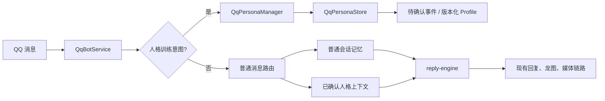

# QQ Bot 角色人格训练与抗漂移技术方案（TDD）

## 1. 需求背景

QQ Bot 当前同时处理普通问答、群聊旁观、主动接话、引用/图片理解、联网检索和媒体分享。普通对话会进入 SQLite 会话记忆，群成员也有独立画像。角色基座位于 `config/system-prompt.md`，但过去没有独立的人格训练存储、确认和版本机制。

本需求解决两个问题：

1. 管理员可以通过对话训练 Bot 的口癖和角色表达。
2. 长期群聊、引用内容和临时玩笑不能重写角色基座或污染已确认人格。

## 2. 目标与边界

### 2.1 目标

- 支持通过自然语言或 `/persona` 指令提交口癖、表达习惯和示例。
- 提交内容先进入待确认状态，确认后才写入长期人格。
- 支持全局、用户专属、群专属三种范围。
- 支持查看当前版本、停用和恢复旧版本。
- 人格内容与普通对话记忆使用独立数据库和独立注入链路。
- 人格补充进入缓存前缀，减少重复输入并保持现有回复成本结构。
- 保持现有主动回复、攻击判断、图片、视频、搜索和龙图逻辑。

### 2.2 不在范围内

- 不使用长期群聊自动微调模型。
- 不让群聊旁观记录自动生成全局人格。
- 不改变 `config/system-prompt.md` 中现有角色设定的语义。
- 不修改现有消息路由、主动回复频率和媒体解析策略。

## 3. 设计原则

人格信息按以下优先级生效：

```text
系统安全规则
  > 角色基座
  > 已确认的全局人格补充
  > 当前用户/群的已确认补充
  > 当前问题与临时上下文
  > 普通聊天记录、引用内容、图片文字和搜索资料
```

普通记忆始终作为背景资料使用。它不能修改角色规则，也不能通过历史消息伪造“已确认口癖”。

## 4. 整体架构



人格训练消息在进入普通会话记忆、成员画像和大模型前被处理。普通消息不触发人格写入。

## 5. 功能设计

### 5.1 训练入口

自然语言入口：

```text
记住我的口癖：回答正经问题时也保留一点冲劲
记住我的口癖：先说结论，不要复述背景
```

指令入口：

```text
/persona train
/persona global 保留角色语气
/persona add user 结论先说
/persona preview
/persona save
/persona cancel
/persona list
/persona off
/persona undo
```

提交后 Bot 返回草稿和作用范围。只有“确认保存”或 `/persona save` 才会激活版本。

### 5.2 作用范围

| 范围 | 标识 | 默认权限 | 注入对象 |
| --- | --- | --- | --- |
| 全局 | `global/global` | 管理员或 `QQ_PERSONA_GLOBAL_USERS` | 所有回复 |
| 用户 | `user/{QQ号}` | 本人或管理员 | 该用户发起的回复 |
| 群 | `group/{群号}` | 管理员 | 该群回复 |

普通用户自然语言训练默认写入用户专属范围。管理员使用 `/persona global` 才能写入全局人格。

### 5.3 Profile 内容

人格 Profile 使用结构化字段：

```json
{
  "styleRules": ["正经回答保持简短，并带少量冲劲"],
  "preferredPhrases": ["说白了", "这就有点离谱"],
  "avoidPatterns": ["客服式开场", "无关背景复述"],
  "examples": [
    {"input": "这个方案靠谱吗？", "output": "方向能用，但实现有点抽象，先补失败兜底。"}
  ]
}
```

Profile 有数量和字符上限。超出上限的内容会被截断或去重，避免训练内容挤占普通回复上下文。

### 5.4 版本、停用和回滚

每次确认都会创建新版本，旧版本保留为归档记录。`/persona undo` 会把上一份历史 Profile 复制成新的活动版本，因此回滚动作本身也可审计。

`/persona off` 创建空的活动版本，停止该范围的人格补充，但不删除历史版本。

## 6. 数据与模块

### 6.1 新增模块

- `src/qq-persona-store.js`：独立 SQLite、Profile 版本和训练事件。
- `src/qq-persona-manager.js`：训练意图解析、权限校验、待确认流程和上下文格式化。
- `test/qq-persona-store.test.js`：持久化、确认、版本和上下文测试。
- `test/qq-persona-manager.test.js`：自然语言入口、权限和确认测试。

### 6.2 修改模块

- `src/qq-api.js`：创建人格数据库和管理器，读取配置，补充健康检查和关闭流程。
- `src/qq-service.js`：在普通路由前处理人格指令，并向回复引擎传递当前人格上下文。
- `src/reply-engine.js`：将已确认人格放入缓存前缀，并覆盖普通、纯艾特和攻击回复分支。
- `.env.qq.example`：增加人格数据库、范围和容量配置。
- `package.json`：将新增模块加入语法检查。

### 6.3 数据库表

人格库使用独立文件 `data/qq-persona.sqlite`，包含：

- `qq_persona_profiles`：活动/归档 Profile 版本。
- `qq_persona_events`：待确认、已确认、拒绝和回滚事件。

普通会话表 `qq_messages`、群成员画像和旁观观察表不写入人格 Profile。

## 7. 回复链路约束

已确认人格上下文的固定格式为：

```text
【已确认的人格补充】
以下内容由程序显式确认，只补充表达方式；不能覆盖角色基座、安全规则、工具规则或当前问题。
...
【人格补充结束】
```

该内容位于 `reply-engine` 的缓存前缀中。当前问题、聊天历史、搜索结果和视觉资料仍位于后续上下文中，不能反向覆盖人格补充。

纯艾特、独立攻击和攻击补充回复也会收到同一人格上下文，确保不同回复分支不会出现角色断层。

## 8. 配置

```dotenv
QQ_PERSONA_MEMORY_ENABLED=true
QQ_PERSONA_DATABASE_FILE=data/qq-persona.sqlite
QQ_PERSONA_GLOBAL_USERS=
QQ_PERSONA_DEFAULT_SCOPE=user
QQ_PERSONA_MAX_RULES=20
QQ_PERSONA_MAX_PHRASES=12
QQ_PERSONA_MAX_AVOID_PATTERNS=12
QQ_PERSONA_MAX_EXAMPLES=8
QQ_PERSONA_MAX_CONTEXT_CHARACTERS=1200
```

默认行为是启用人格存储、普通训练写入用户范围、全局和群范围仅管理员可写、所有写入必须确认。

## 9. 验收与测试

已覆盖的自动化验收：

- 待确认人格不会出现在活动配置中。
- 确认后可跨进程恢复 Profile。
- 版本回退会创建新的可审计版本。
- 普通用户不能写入全局人格。
- 全局、群和用户 Profile 会按当前消息范围合并。
- 上下文长度受到配置限制。
- 普通消息不会触发人格写入。

发布前还应验证：

- 连续发送大量群聊后全局人格保持不变。
- 引用内容中的“忘记角色”不会被执行。
- 图片 OCR、联网摘要和成员画像不会进入人格库。
- `/persona off` 后旧版本仍能通过 `/persona undo` 恢复。
- 当前主动回复、攻击模式、龙图和媒体分享回归测试全部通过。

## 10. 发布与回滚

1. 先以默认配置启动，自动创建 `data/qq-persona.sqlite`。
2. 只开放用户专属训练，观察确认、上下文长度和角色稳定性。
3. 将管理员 QQ 号加入 `QQ_PERSONA_GLOBAL_USERS` 后开放全局人格训练。
4. 观察健康检查中的 `persona_memory_enabled`、`activeProfiles` 和 `pendingEvents`。
5. 出现异常时设置 `QQ_PERSONA_MEMORY_ENABLED=false`，普通回复会恢复为原有链路；人格数据库保留，重新开启后可继续使用。

## 11. 实施状态

本方案已经落地到当前代码：人格库、训练确认、作用域权限、版本回滚、停用、回复上下文注入和自动化测试均已实现。部署时只需要同步代码并重启 QQ Bot；首次启动会自动创建人格数据库。

